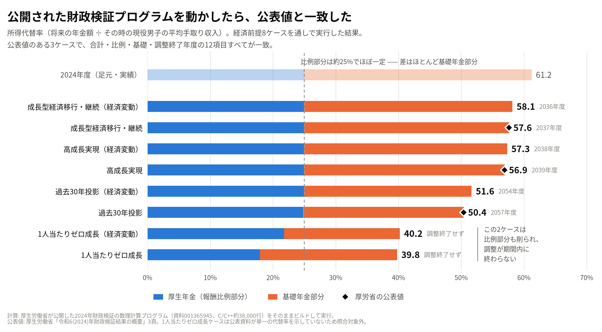

# 公的年金 財政検証（2024年／令和6年）— 再現・Python移植・原本不具合の台帳

**GitHub リポジトリ:** [p72/nenkin-zaisei-kensyo-2024](https://github.com/p72/nenkin-zaisei-kensyo-2024)（ソースコード・原本の取得スクリプト・Issue）

> ### ⚠️ これは厚生労働省が作成したものではありません
>
> **非公式のリポジトリです。** 厚生労働省の承認・監修・関与を一切受けていません。
> 公開されている計算プログラムと資料を読んで、第三者が独自に検証したものです。
> 数値が公表値と食い違う場合、**原因はこちら側にあると考えてください。**
> 公表値が正です。
>
> ここで出てくる年金額・所得代替率は、**個人の年金見込額ではありません。**
> ご自身の年金は「ねんきんネット」か年金事務所へ。

厚生労働省が公開した**2024年財政検証の数理計算プログラム**（111本・38,208行）を
そのまま動かし、公表値と突き合わせ、そこから数理モデルを文書に復元したものです。
さらに**6系統すべてを Python に移植して原本と出力をバイト単位で突き合わせ**、
その過程で見つかった原本の不具合・癖を台帳にしました。

**読みものとしては、この2つから入るのがおすすめです。**

| 読みたいもの | どこ |
|---|---|
| **厚労省のC/C++コードで年金制度を勉強する** — 基礎年金拠出金・適用拡大・マクロ経済スライド・有限均衡・調整期間の一致・所得代替率・国庫負担を、計算しているファイルと行番号まで降りて解説 | **[勉強/README.md](勉強/README.md)** |
| **第3号被保険者を廃止したら年金はどうなるか** — 公表試算に無い政策を、原本のプログラムにパッチを当てて計算した独自試算（厚労省の試算ではありません）。基礎年金拠出金の按分をどう扱うかで結論が逆向きになる | **[検証/3号廃止/README.md](検証/3号廃止/README.md)** |

| やったこと | 結果 |
|---|---|
| 6系統を最初から最後まで通す | 1ケース **2分35秒**（ビルド込み） |
| 財政見通しを公表値と照合 | 11ケース・**41,904項目・不一致0** |
| 掲載表（給付費・拠出金・交付金）と照合 | 4ケース・**5,886項目・不一致0** |
| オプション試算のレバー | **6本**実装（適用拡大・45年化・高在老撤廃・標準報酬上限・調整期間の一致・名目下限撤廃・キャリーオーバー） |
| 数理モデルの復元 | 仕様書 **§0〜§15＋付録A・B**、各式にソースの行番号つき |
| **6系統すべてを Python に移植** | Python **46,314行**。出力が原本と**バイト一致**（⑤690MB・②401MB・③20MB ほか）。テスト213件 |
| **原本の不具合・癖の洗い出し** | **110項目**を台帳に。うち**結果が変わるもの**は②に2件・③に2件 |

## 主な3本

| 読みたいもの | どこ |
|---|---|
| **数式モデルの仕様書** — 原本から復元した算式。各式にソースの行番号つき | **[年金財政検証_数式モデル.md](年金財政検証_数式モデル.md)** |
| **Python への移植** — 6系統 46,314行。原本と出力がバイト一致 | **[検証/移植/README.md](検証/移植/README.md)** |
| **原本不具合の台帳** — 110項目。うち結果が変わるものは4件 | **[検証/原本の不具合.md](検証/原本の不具合.md)** |

関連: 同じプログラムを Python に移植した厚労科研の報告書（川出ほか 2026）との
比較は [検証/先行研究との比較.md](検証/先行研究との比較.md)。報告書が
「FMA の累積誤差」とする nat の 2.36% の差を、原本を `-O2 -mfma` で建て直して
実測した（相対 1e-12 まで）。

## 出典

> 出典：厚生労働省ホームページ「令和6(2024)年財政検証」
> <https://www.mhlw.go.jp/stf/seisakunitsuite/bunya/nenkin/nenkin/zaisei-kensyo/index.html>

**このリポジトリは厚生労働省の資料を同梱していません。** `./fetch.sh` が正式な
公開URLから取得して SHA256 を照合します。ライセンス・免責・加工表記は
**[LICENSE](LICENSE)** にまとめてあります（成果物は文書 CC BY 4.0／コード MIT、
取得する資料は厚生労働省の PDL1.0）。

プログラムの中身を読み解くときの一次資料:
[令和6(2024)年財政検証結果レポート](https://www.mhlw.go.jp/stf/seisakunitsuite/bunya/nenkin/nenkin/zaisei-kensyo/R6suuri_report.html)
（全7章。第7章が数式編で、記号表と算式が載っています）

---

## 3分で動かす

```bash
git clone https://github.com/p72/nenkin-zaisei-kensyo-2024.git
cd nenkin-zaisei-kensyo-2024

./fetch.sh                        # 厚労省の公表資料を取得（約82MB、SHA256照合）
検証/実行/run_pipeline.sh 3001    # 高成長実現ケースを通しで計算（2分35秒）
```

最後にこう出ます。

```
 最終代替率
  一元化モデル：56.9122495807026
      うち比例：24.9711420191125 , うち基礎：31.9411075615900
 調整最終年度  厚年： 24 (99.0024000000000)  国年： 39 (87.3217634180681)
```

公表値は 56.9%／25.0%／31.9%、調整終了年度 2039年度。一致します。
詳細結果等のフル精度（`56.9122495807025`／`24.9711420191125`／
`31.9411075615900`）とも、基礎・比例は完全一致、合計は倍精度1つ分の差です。

プログラムだけ欲しいなら `./fetch.sh program`（15MB）。
公表値との照合までするなら全部（82MB）が必要です。

必要なもの: `gcc` / `g++`、`iconv`、`patch`、`curl`、`python3`、約3GBの空きディスク。

---

## まず読むもの

**[年金財政検証_数式モデル.md](年金財政検証_数式モデル.md)** — 38,208行のC/C++から
復元した数理モデル仕様書。年金制度そのものが理解できる形に再構成してあります。

§0〜§15＋付録A・B。各式にソースファイル・行番号を付けてあるので、コードと突き合わせて追えます。

| 節 | 内容 |
|---|---|
| §1 | 記号と添字の規約（年度は西暦 − 2000） |
| §2 | 人口 → 労働力 → 被保険者数（外枠） |
| §3 | 経済前提（実質→名目変換） |
| §4 | 被保険者の状態遷移（コホート・コンポーネント法） |
| §5 | 年金額の算定式（基礎年金・報酬比例・障害・遺族・マクロ経済スライド） |
| §6 | 基礎年金拠出金の頭割り |
| §7 | 財政収支と積立金 |
| §8 | 有限均衡方式の数値求解（2段階・整数探索 + 二分法128回） |
| §9 | 所得代替率 |
| §10 | 分布推計（マイクロシミュレーション・状態空間の特定） |
| §11 | オプション試算のスイッチ |
| §12 | **実行する**（ビルドと移植パッチ） |
| §13 | 制度パラメータ早見表 |
| §14 | 全体のデータフロー |
| §15 | **数値検証**（通し実行・差分テスト・掲載表照合・レポート数式編との式の照合） |
| 付録A | ファイルと数式の対応表 |
| 付録B | **復元しきれなかった部分**（残り1件） |

---

## ディレクトリ構成

```
fetch.sh                   厚労省の公表資料を取得して papers/ に展開（SHA256照合）
LICENSE                    ライセンス・出典・免責
年金財政検証_数式モデル.md   数理モデル仕様書

papers/                    ← ./fetch.sh が作る。リポジトリには入っていない
papers/001365945/
├── プログラム/        C / C++ ソース 38,208行（6系統）
│   ├── 被保険者推計/       C   3,911行  人口→労働力→被保険者数（外枠）
│   ├── 厚生年金/
│   │   ├── 給付費推計/     C++ 10,864行 厚年＋3共済の受給者数・給付費
│   │   └── 収支計算/       C   3,936行  積立金・財政均衡
│   ├── 国民年金/           C   11,067行 第1号・第3号と国民年金給付
│   ├── 基礎年金/           C   5,468行  頭割り・マクロ経済スライド
│   └── 分布推計/           C++ 2,962行  個人単位モンテカルロ
└── データ/suuri/rev2024/   入力CSV 8,093本（117MB）
    ├── wakuc/   87本   労働力率・将来人口・適用拡大シナリオ
    ├── emp/     47本   経済前提8ケース・4制度の基礎率／基礎数
    ├── nat/     81本   国民年金の基礎数・基礎率
    ├── bas/      5本   入出力ファイルリスト2本＋基礎データ3本
    └── bunpu/ 7,873本  分布推計の遷移表（確率ではなく絶対人数）

papers/001286770/          詳細結果等1 通常試算の財政見通し34本・被保険者数23本
papers/001286771/          詳細結果等2 オプション試算の財政見通し92本・被保険者数27本
papers/001270447/          詳細結果等3 給付と負担・分布推計ほか8表
papers/2024report_back/    結果レポートの掲載表

勉強/                      制度の仕組みを原本のコードで学ぶ解説
├── README.md              読む順番・前提知識・読み方の約束
├── 基礎年金拠出金.md      基礎年金拠出金を厚労省のC/C++コードで解説する
├── 適用拡大.md            被用者保険の適用拡大を厚労省のC/C++コードで解説する
├── マクロ経済スライド.md  マクロ経済スライドを厚労省のC/C++コードで解説する
├── 有限均衡.md            有限均衡方式を厚労省のC/C++コードで解説する
├── 調整期間の一致.md      マクロ経済スライドの調整期間の一致を厚労省のC/C++コードで解説する
├── 所得代替率.md          所得代替率を厚労省のC/C++コードで解説する
├── 国庫負担.md            国庫負担を厚労省のC/C++コードで解説する
├── 特別国庫負担.md        特別国庫負担を厚労省のC/C++コードで解説する
└── 応用編/                 仕組みを使ってシナリオを比べる
    ├── マクロ経済スライドの終了年度の違い.md
    ├── 運用利回りと保険料.md    運用4.95%が続いたら保険料は下げられるか
    ├── 運用利回り.py            その再現スクリプト
    ├── 厚生年金の国庫負担をなくしたら.md  国庫負担をなくすと報酬比例と国の財政はどうなるか
    ├── 国庫負担の廃止.py        その再現スクリプト
    ├── 第3号の保険料をどちらの財布に入れるか.md  是枝レポートの検証と、厚年留保案・按分据置型の比較
    └── 第3号の保険料.py          その再現スクリプト

検証/
├── 実行/                  プログラムを通しで動かす
│   ├── run_pipeline.sh      ①〜⑤を順に流して所得代替率まで出す
│   ├── run_all_cases.sh     経済前提8ケースを順に流して一覧にする
│   ├── make_kisosuu.py      ⑥の初期母集団を遷移表から組み立てる
│   ├── run_bunpu.sh         ⑥の前段を揃えて分布推計を動かす
│   ├── nat_build_flags.py   原本③を -O2 / -mfma / -Ofast で建て比べ、出力の差を測る
│   └── patches/             glibc 移植性パッチ（実質29行）
├── 掲載表/                レポート掲載表とのフル精度照合
│   └── compare_keisaihyou.py 給付費・拠出金・交付金の4表 × 4ケース
├── オプション試算/        詳細結果等の財政見通しとのフル精度照合
│   └── compare_option.py    収入・支出の全項目＋所得代替率＋モデル年金額
├── 数式編/                レポート数式編との式の照合
│   ├── verify_shikihen.py   マクロ経済スライドの向きと均衡条件を実測で判定
│   ├── verify_cc.py         ⑤の収支項目名と給付水準調整割合の漸化式
│   └── verify_bunpu_func.py ⑥の関数とレポート第5章の手順の対応
├── 図/                    プレゼン用の図
│   ├── make_chart.py        8ケースの所得代替率と公表値の照合（matplotlib）
│   └── 所得代替率_8ケース.png
├── 3号廃止/               原本にないレバー: 第3号に保険料を求める2つの財政構造
│   ├── run_sango.sh         ベース・第1号移行型・按分据置型・調整期間一致を一式流す
│   ├── analyze_sango.py     ④⑤の出力から比較表（結果.md）と図を作る
│   ├── make_anbun_chart.py  §4.7 の所得代替率の図
│   └── README.md            問い・実装・結果・限界
├── 移植/                  原本の C/C++ を Python に移植（6系統すべて完了。行数は原本→Python）
│   ├── emp_shushi/          ⑤厚生年金 収支計算（3,936→4,684行）。出力バイト一致
│   ├── bunpu/               ⑥分布推計（2,962→3,175行）。出力バイト一致
│   ├── hihokensha/          ①被保険者推計（3,911→4,186行）。104本中103本一致
│   ├── kiso_nenkin/         ④基礎年金（5,468→4,706行）。出力バイト一致
│   ├── emp_kyufu/           ②厚生年金 給付費推計（10,864→12,627行）。18本中15本一致
│   ├── nat/                 ③国民年金（11,067→9,268行）。出力11本バイト一致
│   ├── clib/                C/C++ の標準ライブラリを再現（mt19937 ほか）
│   ├── portpath.py          システムをまたぐ同名モジュールの解決（17個ぶつかる）
│   ├── harness_*.c(pp)      原本を無修正でリンクして問い合わせるハーネス（14本・2,197行）
│   └── test_*.py            原本との差分テスト（21本・7,713行、213件）
├── 原本の不具合.md        原本で見つけた不具合・癖の台帳
├── 先行研究との比較.md    厚労科研の Python 移植報告書（川出ほか 2026）との比較
├── 出力カタログ.md        1シナリオで何が手に入るかの棚卸し
├── verify_kaiteiritu.py   公表値との照合サマリ（依存ライブラリなし）
├── test_econ.py           テストスイート（pytest）
└── differential/          原本Cとの差分テスト
    ├── port_econ.py         国民年金/econ.c の忠実移植
    ├── harness.cpp          原本Cを無修正でコンパイルして走らせる
    ├── build_and_run.sh     ビルド＋実行
    ├── compare.py           C出力とPython出力を1要素ずつ照合
    └── run_all.sh           同梱8ケースすべてで回す
```

1シナリオを流すと出てくるもの（177本・2.15GB）の一覧は
`検証/出力カタログ.md` にあります。所得代替率・積立度合・収支の全項目・
給付費の最細分（年度×性×給付種別×新旧×在退×内訳×年齢）がどのファイルの
どのブロックにあるかの早見表つきです。

各ディレクトリに README があります（`検証/README.md`、`検証/実行/README.md`、
`検証/掲載表/README.md`、`検証/オプション試算/README.md`、
`検証/数式編/README.md`、`検証/図/README.md`）。

## 実行順序

```
① 被保険者推計 → ② 厚生年金給付費推計 ┐
                  ③ 国民年金          ├→ ④ 基礎年金 → ⑤ 収支計算
                                      ┘
（別建て）⑥ 分布推計
```

依存関係は「まず被保険者が何人いるか」→「厚生年金の給付はいくらか」→
「基礎年金の負担はいくらか」→「収支は合うか」の順です。

---

## 扱ううえでの注意

### 文字コード

ソースは **EUC-JP**（Solaris/UNIX由来）。そのまま開くと文字化けします。

ただし丸数字（①②③④）が **NEC特殊文字**として入っているため、標準の
`EUC-JP` では3本のファイルで変換に失敗します（`被保険者推計/cntl.c`、
`収支計算/shus_out.c`、`収支計算/shus_fullout.c`）。NEC/IBM拡張を含む
**`EUCJP-MS`** を指定してください。

```bash
iconv -f EUCJP-MS -t UTF-8 papers/001365945/プログラム/国民年金/main.c
```

`.gitattributes` で `* -text` を指定し、改行・テキスト正規化を無効化して
**バイト単位で原本を保全**しています。

### 手元で動かす

```bash
git clone https://github.com/p72/nenkin-zaisei-kensyo-2024.git
cd nenkin-zaisei-kensyo-2024
./fetch.sh                       # 厚労省の公表資料を papers/ に取得（約82MB、SHA256照合）
```

**必要なもの**: `gcc`／`g++`、`iconv`（`EUCJP-MS` 対応）、`patch`、`python3`、
空きディスク約3GB（1ケースの出力が約2GB）。

```bash
pip install pytest openpyxl matplotlib   # openpyxl は掲載表照合、matplotlib は図
```

**そのまま動きます。** `sudo` もルート権限も要りません。

```bash
python3 -m pytest 検証/          # 65件、数秒
検証/実行/run_pipeline.sh 3001   # 高成長実現ケース（10〜15分）
```

プログラムは出力先も入力ファイルリストも `/suuri/rev2024` という絶対パスで
持っていますが（専用UNIXサーバの固定構成が前提だった名残）、
`run_pipeline.sh` が**コピーの上で書き換えて**リポジトリ内の `work/` に
寄せます。原本は触りません（仕様書 §12.1）。

```bash
検証/実行/run_pipeline.sh 3001                 # 既定: <リポジトリ>/work/suuri/rev2024
SUURI_PREFIX=/ 検証/実行/run_pipeline.sh 3001  # 従来: /suuri/rev2024
SUURI_PREFIX=/mnt/d 検証/実行/run_pipeline.sh 3001
```

`work/` は `.gitignore` 済みです。1ケースで約2GB使うので、**空きは約3GB**
見てください。消すときは `rm -rf work` だけです。

置き場所を変えても結果は変わりません。`work/` と従来の `/suuri` の両方で
走らせて、⑤の `90nenbe`（212万行）と④の `kekka*a.csv` が **md5 まで一致**
することを確認済みです（仕様書 §12.1）。

#### まず軽いほうから

通し実行は1ケース10〜15分かかります。**通し実行なしで動く検証**があるので、
そこまで通してから先に進むのが楽です。

| 通し実行なしで動く | 内容 |
|---|---|
| `python3 -m pytest 検証/` | 65件。原本Cを一時ディレクトリでコンパイルするので `g++` は必要 |
| `検証/differential/run_all.sh` | 8ケース × 28,304項目の差分テスト |
| `python3 検証/verify_kaiteiritu.py` | 公表値との照合サマリ（依存ライブラリなし） |
| `python3 検証/数式編/verify_bunpu_func.py` | ⑥の関数とレポートの手順の対応（ソースを読むだけ） |
| `python3 検証/図/make_chart.py` | 図の生成 |

| 通し実行の出力が必要 | 内容 |
|---|---|
| `検証/掲載表/compare_keisaihyou.py` | 掲載表との照合（5,886項目） |
| `検証/オプション試算/compare_option.py` | 詳細結果等の財政見通しとの照合 |
| `検証/数式編/verify_shikihen.py` | マクロの向きと均衡条件を実測で判定 |
| `検証/数式編/verify_cc.py` | 検証Bだけ。検証A・Cはソースを読むだけなので不要 |

通し実行の最後にこう出れば再現できています。

```
最終代替率
 一元化モデル：56.9122495807026
     うち比例：24.9711420191125 , うち基礎：31.9411075615900
```

### 動きます

```bash
検証/実行/run_pipeline.sh 3001          # 高成長実現ケース
検証/実行/run_pipeline.sh 3003 1 1 0 2  # 過去30年投影ケース
検証/実行/run_all_cases.sh              # 経済前提8ケース全部
検証/実行/run_bunpu.sh 2011 3001        # 分布推計（マイクロシミュレーション）
```

**6系統すべてが最初から最後まで通ります。** うち①〜⑤は同梱データだけで
**公表された所得代替率を再現します**。



公表値が出ている3ケースとの対照（左が計算値、太字が公表値）。

| 項目 | 高成長実現 | 成長型経済移行・継続 | 過去30年投影 |
|---|---|---|---|
| 所得代替率 合計 | 56.9122 / **56.9** | 57.6207 / **57.6** | 50.3915 / **50.4** |
| うち 比例部分 | 24.9711 / **25.0** | 24.9711 / **25.0** | 24.8761 / **24.9** |
| うち 基礎部分 | 31.9411 / **31.9** | 32.6495 / **32.6** | 25.5154 / **25.5** |
| 調整終了年度（比例） | 調整なし / **調整なし** | 調整なし / **調整なし** | 2026 / **2026** |
| 調整終了年度（基礎） | 2039 / **2039** | 2037 / **2037** | 2057 / **2057** |

**15項目すべて一致します。** 経済前提8ケース全部の結果は仕様書 §15.0.0 に
まとめました。1人当たりゼロ成長ケースは公表資料が単一の所得代替率を出していない
ため（国民年金の積立金が枯渇し賦課方式へ移行）直接比較できません。
経済変動ケース4本も概要には載っていません。

### フル精度での照合 — 5,886項目が全一致

上の表の公表値は四捨五入されているので、有効桁が3桁しかありません。
レポートには**掲載表**（`2024report_back.zip`）が別添されていて、そちらは
**フル精度**で載っています。2024年度の厚生年金給付費なら
`30.012065887192918` 兆円。桁落ちなしで判定できます。

```bash
./fetch.sh                                 # 未取得なら
python3 検証/掲載表/compare_keisaihyou.py --keisaihyou papers/2024report_back
```

| 掲載表 | 高成長実現 | 成長型経済移行 | 過去30年投影 | 1人当たりゼロ成長 |
|---|---|---|---|---|
| 第3-7-29表 厚生年金給付費 | 388/388 | 388/388 | 388/388 | 144/144 |
| 第3-7-33表 基礎年金給付費 | 388/388 | 388/388 | 388/388 | 144/144 |
| 第3-7-34表 基礎年金拠出金 | 485/485 | 485/485 | 485/485 | 180/180 |
| 第3-7-35表 基礎年金交付金 | 485/485 | 485/485 | 485/485 | 180/180 |

**4表 × 4ケース × 全年度 × 全内訳 = 5,886項目、不一致ゼロ。**
最大相対差は `1.3e-14` で、倍精度の丸めそのものです（`-O2` ビルド。`-Ofast`
で建てた旧ビルドでは `1.8e-14`。どちらでも不一致ゼロ）。詳細は仕様書 §15.0.2。

各表の「2024年度価格」列も含めて一致します。換算率は④基礎年金が持つ
2004年度価格への換算率 `kakaku[]` の比で、`kakaku[2024] = 0.999`、
`kakaku[2025] = 1.030`（2025年度で小数3桁に丸める）なので、その比が
ちょうど `1030/999 = 1.031031031…` になります。初版で「出所が特定できない」
と書いていた1要素はこれでした（§15.0.2）。

### 財政見通しの全項目 — 詳細結果等との照合

掲載表の4表よりさらに広い照合ができます。レポートの**詳細結果等**には
財政見通しの Excel が126本入っていて、**収入・支出の全項目と所得代替率・
モデル年金額**がフル精度で載っています。

| 資料 | 中身 |
|---|---|
| [詳細結果等1](https://www.mhlw.go.jp/content/001286770.zip)（28MB） | 通常試算 財政見通し34本 |
| [詳細結果等2](https://www.mhlw.go.jp/content/001286771.zip)（37MB） | オプション試算 財政見通し92本 |

**オプション試算のレバーを6本実装しました。**

| 環境変数 | オプション |
|---|---|
| `KAKUDAI` | 被用者保険の適用拡大（90／200／270／860万人・最低賃金1500円） |
| `SIGO` | 基礎年金の拠出期間45年化 |
| `KOZAX` | 65歳以上の在職老齢年金の撤廃 |
| `HOUJOU` | 標準報酬月額の上限の見直し（75／83／98万円） |
| `TOUGOU` | マクロ経済スライドの調整期間の一致 |
| `DMACRO` | 名目下限措置の撤廃 |
| `CARRY` | キャリーオーバー（1=あり、既定） |
| `SANGO` `SANGO_MODE` `NIGO` `SANGO_NOUFU` | **原本にない追加レバー**: 第3号・第2号に保険料を求める場合の実施年度・財政構造・納付率。公表値との照合対象ではない（下記） |
| `ICHIGO` | **原本にない追加レバー**: 第1号の全員を第3号として登録する実施年度（思考実験）。公表値との照合対象ではない |
| `KOKKO` | **原本にない追加レバー**: 厚生年金（被用者年金4制度）への国庫負担をなくす実施年度（思考実験）。`KOKKO_MODE` で調整方法を選ぶ。公表値との照合対象ではない |
| `RYUHO` `RYUHO_RITU` | **原本にない追加レバー**: 第3号の保険料を厚生年金勘定に入れる「厚年留保案」の実施年度と保険料の割合。厚生年金保険料率の引き下げ幅を求める。公表値との照合対象ではない |

```bash
検証/実行/run_pipeline.sh 3001                      # 通常試算
TOUGOU=1 YOBI2=001 検証/実行/run_pipeline.sh 3001   # 調整期間の一致
python3 検証/オプション試算/compare_option.py \
    --published '.../21.　調整期間の一致　人口中位　高成長実現ケース.xlsx' \
    --bas-yobi 001
```

| 公表 | ケース | レバー | 項目 | 不一致 |
|---|---|---|---|---|
| 等1 No.01 | 高成長実現 | ― | 3,977 | 0 |
| 等1 No.03 | 過去30年投影 | ― | 3,977 | 0 |
| 等1 No.11 | 出生低位・過去30年投影 | ― | 3,977 | 0 |
| 等2 No.81 | 高成長実現（経済変動） | ― | 3,977 | 0 |
| 等2 No.21 | 高成長実現 | **調整期間の一致** | 2,134 | 0 |
| 等2 No.25 | 過去30年投影 | **高在老の撤廃** | 3,977 | 0 |
| 等2 No.26-28 | 出生低位・過去30年投影 | **標報上限 75／83／98万円** | 3,977×3 | 0 |
| 等2 No.85 | 高成長実現（経済変動） | **名目下限の撤廃** | 3,977 | 0 |
| 等2 No.89 | 高成長実現（経済変動） | **キャリーオーバー廃止** | 3,977 | 0 |

**11ケース・41,904項目、不一致ゼロ。** 所得代替率（給付水準の調整終了後）は
15桁で一致します（調整期間の一致で `61.1848667937229`％、名目下限の撤廃で
`57.3047212716503`％、キャリーオーバー廃止で `57.2696183523240`％）。

同梱の Makefile と同じ **`-O2` ビルド**で取り直した数字です（2026-09-23）。
`-Ofast`（演算順の書き換えを許す）で建てた旧ビルドでも不一致ゼロで、
**結論はビルド指定に依存しません**。正とするのは `-O2` のほうです
（`検証/オプション試算/README.md`「ビルド指定を変えても結論は動かない」）。

詳しくは `検証/オプション試算/README.md`、仕様書 §11.1・§11.2・§15.9。

### 第3号被保険者に保険料を求める — 原本にないレバーで「もし」を計算する

公表されたオプション試算には無い政策を、④基礎年金にパッチを当てて計算しました。
厚労省の試算ではなく、このリポジトリの独自計算です。

第3号（約650万人）から保険料を徴収する場合に、基礎年金拠出金の按分をどう扱うかで
2つの財政構造があります。

| 呼び名 | 内容 | レバー |
|---|---|---|
| 第1号移行型 | 第3号を第1号にし、拠出金の按分の頭数も国民年金へ移す | `SANGO_MODE=0` |
| 拠出金按分据置型（国年充当） | 保険料は徴収するが、3号分の基礎年金費用は引き続き被用者年金が負担 | `SANGO_MODE=1` |

```bash
検証/実行/run_pipeline.sh 3003 1 1 0 2                                           # 通常試算（先に通す）
STEPS=45 YOBI=301 SANGO=2027 検証/実行/run_pipeline.sh 3003 1 1 0 2               # 第1号移行型
STEPS=45 YOBI=501 SANGO=2027 SANGO_MODE=1 検証/実行/run_pipeline.sh 3003 1 1 0 2  # 拠出金按分据置型
検証/3号廃止/run_sango.sh && python3 検証/3号廃止/analyze_sango.py               # 一式＋比較表・図
```

結果と解釈は **[検証/3号廃止/README.md](検証/3号廃止/README.md)**、数表は
`検証/3号廃止/結果.md`。

要点は、第1号の保険料（月17,000円×改定率、実効17,600円）が基礎年金の1人当たり
実負担（拠出金単価−国庫負担単価、約21,000円）を下回っていることです。そのため
第1号移行型では「保険料を払う1号」の頭数が倍になり、**国民年金勘定は赤字を積み増して
2054年度に積立金が負になります**。

**結果は、基礎年金の水準を国民年金勘定だけで決める現行の均衡ルール（勘定の壁）に
強く左右されます。**

| 過去30年投影ケース | 所得代替率 | うち比例 | うち基礎 |
|---|---|---|---|
| 現行制度 | 50.39% | 24.88% | 25.52% |
| 第1号移行型（拠出金の按分も移す） | 36.12%（均衡せず、下の天井） | 24.97% | 11.15% |
| 拠出金按分据置型（国年充当。按分は現行のまま） | 57.94%（基礎は調整不要、上の天井） | 21.73% | 36.21% |
| 現行＋調整期間の一致（壁なし） | 56.16% | 22.92% | 33.24% |
| 3号廃止＋調整期間の一致（按分の置き方によらず15桁一致） | **57.52%** | 23.48% | 34.04% |

- 3号廃止で被用者年金に生まれる「3.1兆円の黒字」はグロスで、国庫負担の減1.56兆円を
  差し引いた正味は1.56兆円（うち1.47兆円が収支差の改善）。公的年金全体の純増は元3号が
  払う**1.23兆円だけ**で、残りは配分の付け替えです
- **勘定の壁を外して比べると、3号の保険料そのものの効果は +1.36pt**（過去30年投影。
  高成長実現では ±0）
- 拠出金按分据置型の +7.55pt の大半は、壁が逆向きに振れた効果です。上がった基礎年金の
  費用は大半を厚生年金（報酬比例 −3.15pt）と**国庫（2100年度に年7兆円増）**が払います。
  国庫負担の増は基礎年金を上げれば必ず付いてくる値段（法定の1/2）で、高成長実現では
  厚労省の調整期間の一致と同額です。3号の保険料の多くは給付に使われず国民年金の積立金に
  積み上がります（現在価値で22兆円、2119年度に積立度合53年分）。高所得の単身・共働きは
  損をしうるので、「全員が得をする」とは言えません

同じレバーで第2号まで広げた場合（基礎年金拠出金制度そのものの廃止）も計算できます
（仕様書 §11.3 の `NIGO`）。結果が前提に強く依存するので、この公開リポジトリには
収録していません。

| 系統 | コンパイル | 実行 | 結果 |
|---|---|---|---|
| ① 被保険者推計 | 通る（無修正） | **完走** | 公表値と整合 |
| ② 厚生年金 給付費推計 | 通る（無修正） | **完走** | 同 |
| ③ 国民年金 | 通る（`fdiv` 改名） | **完走** | 同 |
| ④ 基礎年金 | 通る（無修正） | **完走** | 同 |
| ⑤ 厚生年金 収支計算 | 通る（無修正） | **完走** | 同 |
| ⑥ 分布推計 | 通る（無修正） | **完走** | **公表値と比較不可**（下記） |

### ⑥ 分布推計 について

同梱データには初期母集団 `bunpu/kisosuu/` がディレクトリごと欠落しています。
ただし同梱の `kisoritsu01` は**確率ではなく絶対人数**の遷移表なので
（`prog04.cpp` は `std::stoi` で読む）、**基準年齢の翌年齢への遷移表の行和が
基準年齢時点の状態別人数**になります。連鎖の整合性も確認済みで、ある年齢の
列和は次の年齢の遷移表の行和と完全に一致します。

`検証/実行/make_kisosuu.py` はこの関係から初期母集団（計 1,621,872人）を
組み立てます。状態別人数は厚労省のデータそのものです。

**一方、個人ごとの加入月数と年金額は集計表からは原理的に復元できません。**
ここには 0 を入れています（推測値で「それらしい数字」を作ることはしていません）。
その結果、基準年齢17歳のコホートだけが忠実な初期条件になり、
27・37・47・57・62歳のコホートは加入歴を失った状態で走り出します。

実行すると（1,621,872人・約80秒で完走）、**基準年齢17歳のコホートだけが
数値を出し、27歳以上は `-nan` になります**。

```
01_2011_1_1_17.csv（男・17歳から追跡）  65,2069,90.2981,9.0983,0.1405,0.4631
01_2011_1_1_27.csv（男・27歳から追跡）  65,2059,-nan,-nan,-nan,-nan
```

加入月数が0なので集計の分母が0になり、ゼロ除算が伝播します。
**欠落データが効く場所がそのまま出力に現れている**わけです。
17歳コホートは生涯を追うコホートなので、分布推計の本来の用途
（将来の受給者の年金額分布）に対応します。

17歳コホートで残る合成要素は総報酬等級だけですが、これを1から20に変えても
`01_*`・`02_*` は**完全一致**、`03_*` は小数第4位しか動きません。初期の585人は
その後の新規流入（毎年約2,400人）に埋もれ、流入者の報酬は厚労省の
`prob_houshuu_shinki_*` が決めるためです。つまり17歳コホートの出力は
ほぼ全部が厚労省のデータで決まっています。

外枠2011（適用拡大なし）と2211（適用拡大② 200万人ベース）を比べると、
**女性で圧倒的に大きく動きます**（78.9% → 87.6%）。適用拡大は短時間労働者に
効くので政策の筋と方向が一致します。絶対水準は照合できませんが、
プログラムが制度改正の効果を筋の通った形で拾っていることは確認できます。

> **⑥の出力を公表値と比較してはいけません。** 動くことを示すためのもので、
> 厚労省の分布推計結果ではありません。詳細は仕様書 §12.5。

**必要な手当て**

1. 出力先が `/suuri/rev2024/...` 固定 → そこにディレクトリを作ってデータを置く
2. `fdiv()` が新しい glibc の C23 縮小演算関数と名前衝突 → 識別子を一律改名
3. `fclose` まわりの潜在バグ4件（二重クローズ・`fclose(NULL)`）→ 実質29行の
   パッチ（`検証/実行/patches/glibc-portability.patch`）。Solaris では黙認
   されていたもので、計算結果には影響しません

詳細は仕様書 §12。リポジトリ内の原本は書き換えず、UTF-8 に変換したコピーに
パッチを当ててビルドします。

### 数値検証

通し実行（上記）が一番強い検証ですが、それは「全体が合っている」ことしか
言えません。どの式がどう効いているかは、切り出して確かめる必要があります。

```bash
python3 -m pytest 検証/            # 65件（差分テスト8件を含む）
検証/differential/run_all.sh       # 8ケース × 28,304項目
python3 検証/verify_kaiteiritu.py  # 公表値との照合サマリ
```

**① 差分テスト** — 原本 `国民年金/econ.c` を**無修正でコンパイルして走らせ**、
Python移植（`検証/differential/port_econ.py`）の出力と1要素ずつ突き合わせます。
2004〜2125年度 × 0〜115歳 × 2系列 = 28,304項目 × 8ケース、**不一致ゼロ**。
「移植が忠実か」を人の目でなく機械で判定する層です。

**② 公表値照合** — その出力を厚労省の公表値と照合します。

| | 内容 | 結果 |
|---|---|---|
| 検証1 | `econ-XXXX.csv` の列対応と長期の経済前提（4ケース × 4指標） | 16項目一致 |
| 検証2 | 老齢基礎年金の満額（2015〜2024年度、新規裁定・既裁定） | 12項目一致 |
| 検証3 | ソース中のハードコード値と法定値の照合 | 12項目一致 |

検証2は `満額 = 780,900円 × 改定率`（国民年金法27条）を、名目手取り賃金変動率・
可処分所得割合変化率・マクロ経済スライドの名目下限・キャリーオーバー・
丸めの順序まで含めて再現し、10年分の公表額と一致させたものです。

**③ 単位テスト** — 改定率の選択ルールなど、個々の関数を手計算値と照合します
（`検証/test_econ.py`）。

この3層が押さえているのは `国民年金/econ.c` の範囲です。§2・§4・§5.4・
§6・§7・§8 の個別の式については、別に **6系統を丸ごと Python に移植して
原本と出力をバイト単位で突き合わせる**層があります（`検証/移植/`）。ただし
これが示すのは「原本の読み取りが正しい」ことまでで、**公表値との一致は
別問題**です。詳細は仕様書 §15。

### 式そのものの照合 — レポート第7章が数式編だった

数値が合っていても、**式の説明が正しいとは限りません**。仕様書はコードから
式を逆算したものなので、日本語に書き直す過程で誤りが入りえます。

レポート**第7章第1節**（p.572〜614）が厚生労働省自身による数式編で、
**第3章第5節・第6節**が被保険者数推計と給付水準調整の推計方法です。これが
答え合わせの原典になります。全域を突き合わせた結果は仕様書 §15.6・§15.7。

```bash
python3 検証/数式編/verify_shikihen.py     # マクロの向き・均衡条件（実測）
python3 検証/数式編/verify_cc.py           # 収支項目名・R(N,X) の漸化式
python3 検証/数式編/verify_bunpu_func.py   # ⑥の関数と手順の対応
```

**誤り5件・欠落8件が見つかり、すべて直しました。** 主なもの:

| 見つかったこと | どこ |
|---|---|
| 国民年金に再加入があると書いていた（`Saikanyuritu` は恒等的に0で、どのファイルからも読み込まれない） | §4.2 |
| 均衡条件を「2120年度末」と書いていた（正しくは2120年度初＝2119年度末。実行値で 1.000000000000） | §8.1 |
| マクロ経済スライドを「掛ける」と書いていた（コードは**割る**形。`RV / pre_cut`） | §5.7 |
| 障害厚生年金・遺族厚生年金の節が丸ごと無かった（給付費の**21%**） | 新設 §5.6 |
| 受給待期者の系列が丸ごと無かった（「脱退したら年金が消える」と読めてしまう） | §4.3 |
| 特別国庫負担に触れてもいなかった（按分に乗らず全額国庫負担、6区分） | §6.2 |

一方、月割りの 2/6/4 分割、積立金の漸化式の `(1+i)^(1/2)`、改定率の67歳／
68歳の切り替え、調整終了年度の求解手順などは**そのまま合っていました**。

### 付録B — 残り1件

「復元しきれなかった部分」は初版の5項目から**1件**になりました。

| 元の項目 | どうなったか |
|---|---|
| `Cc[4]`〜`Cc[8]` の収支項目名 | **解決**。`shus_out.c` の出力ヘッダにあった。出力ループのスキップ規則と突き合わせていなかっただけ（§7.2） |
| `R(N,X)` の漸化式 | **解決**。`Escutrrh[k][x] = Escutrrh[k-1][x-1]` として代入文で書かれていた（§8.4）。集計値から逆算しようとしたのが誤り |
| 分布推計の `func06a`〜`func09c` | **解決**。レポート第5章の手順①〜⑥と全関数が対応（§10.7）。なお繰上げ・繰下げは扱っておらず、問い自体が誤っていた |
| 掲載表の2024年度価格の換算率 | **機構は解決**。系列はこちらの比例改定率そのもの（2026年度以降 `6.0e-15`）。2024年度の1要素 `1030/999` の出所だけ未特定 |
| 分布推計の出力の意味 | **解決不可**。同梱データに個人ごとの加入月数がなく、集計表からは原理的に復元できない |

---

## 見つけた誤記

`厚生年金/給付費推計/seid.cpp:26-30` の定額部分単価テーブル（生年度別乗率
×1000）で、**昭和11年度（1936年度）生まれの値が `369`** になっています。

```c
1875, 1817, 1761, 1707, 1654, 1603, 1553, 1505, 1458, 1413,
 369, 1327, 1286, 1246, 1208, 1170, 1134, 1099, 1065, 1032
```

日本年金機構の[公表表](https://www.nenkin.go.jp/service/jukyu/seido/kyotsu/nenkingaku/20150401-01.html)と
20項目を照合すると、**19項目が完全一致し、11番目だけ先頭の `1` が欠落**して
います（法定値 1.369 → `1369` であるべき）。

**ただし結果には影響しません。** 実際に `369` → `1369` に直して高成長実現
ケースを①〜⑤通しで再実行したところ、②給付費推計の出力20本は md5 が全本一致、
所得代替率も 56.9122495807026 まで全桁一致でした。この乗率が引かれるのは
昭和11年度生まれのコホートだけで、定額部分の新規裁定（60〜64歳）は
1996〜2000年度に終わっており、推計期間（2015年度以降）に入らないためです。

詳細は仕様書 §5.5。

---

## ライセンス・権利

`papers/` 配下は厚生労働省が公開した資料で、リポジトリには**同梱していません**
（`./fetch.sh` が正式URLから取得して SHA256 を照合します）。利用条件・出典・
加工表記・免責は **[LICENSE](LICENSE)** にまとめてあります。
本リポジトリの独自著作物は `年金財政検証_数式モデル.md`、`検証/` 配下、
および本 README です。
