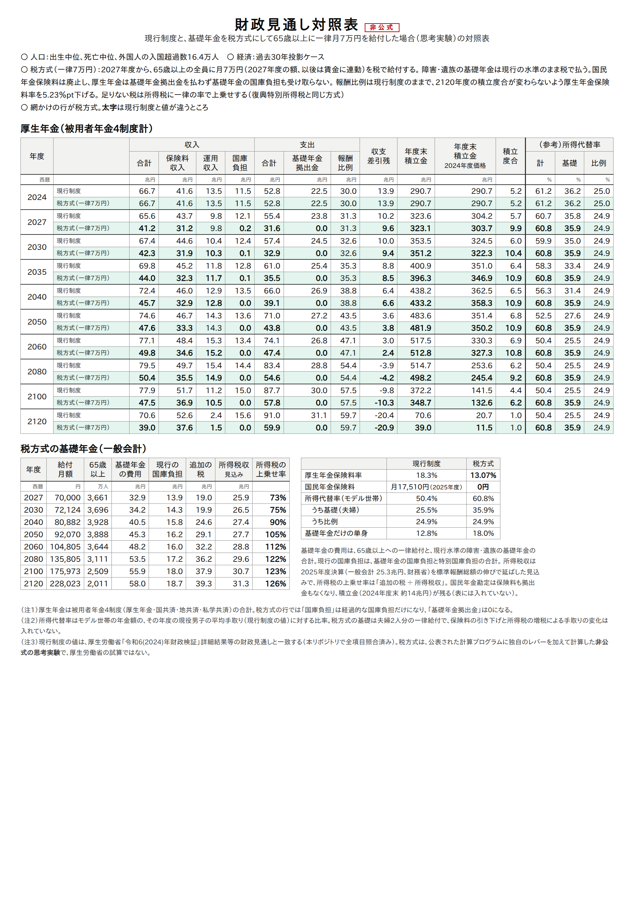
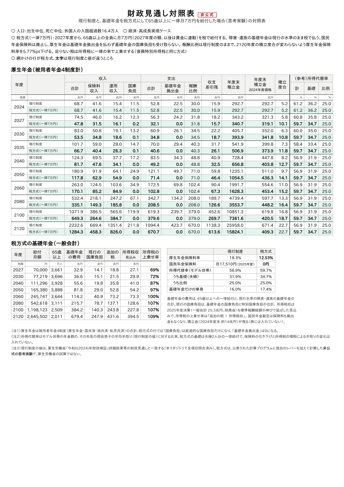

# 基礎年金を税方式にして、65歳以上に一律月7万円を配ったら — 一律7万円・所得税方式

2008年の社会保障国民会議は、基礎年金を全額税でまかなう「税方式」の試算を示した。
そのときの財源は消費税だった
（[社会保障国民会議 最終報告](https://www.mhlw.go.jp/shingi/2008/11/dl/s1112-9g.pdf)）。

ここでは別の設計の税方式を、2024年財政検証の計算プログラムで試算する。
65歳以上の全員に一律の額を配り、財源は所得税に求める。

**結論（過去30年投影ケース）**
- 厚生年金保険料率は **18.3% → 13.07%** に下がり、国民年金保険料は **0** になる
- 所得代替率（モデル世帯）は **50.4% → 60.8%** に上がる。基礎年金だけの人は **12.8% → 18.0%**
- 追加で要る税は、2027年度で **19.0兆円**。今の所得税収に対して **73%** の上乗せになる。
  高齢化とともに上がり、2060年度には **112%** になる
- 家計の負担は、会社員なら**年収およそ530万円より下で減り、上で増える**。
  保険料（定額や定率）を、累進の所得税に置き換えるためである

以下は、厚生労働省の試算ではない**非公式の思考実験**である。

---

## 1. 設計

| 項目 | 一律7万円・所得税方式 |
|---|---|
| 給付 | 2027年度から、**65歳以上の全員に月7万円**。保険料を納めた期間は問わない。2028年度以降は賃金に連動する |
| 障害・遺族の基礎年金 | 現行制度の水準のまま、税で払う |
| 国民年金保険料 | **廃止** |
| 厚生年金保険料 | 基礎年金に当たる分（基礎年金拠出金の負担）を下げる。報酬比例は現行制度のまま |
| 財源 | 足りない分は、**所得税額に一律の率で上乗せ**する（復興特別所得税と同じ方式） |

- 7万円は、2027年度の満額の基礎年金とほぼ同じ額である。現行制度では、この基礎年金が
  マクロ経済スライドで下がっていく（過去30年投影で2057年度まで）。この設計では下げない
- 厚生年金保険料をどれだけ下げられるかは、計算プログラムで求めた。厚生年金が基礎年金拠出金を払わず、
  基礎年金の国庫負担も受け取らない形にする。報酬比例の水準と2120年度の積立度合は現行制度のままとし、
  その条件で下げられる保険料率を出した

## 2. 結果：保険料率と所得代替率

| | 過去30年投影：現行 | 過去30年投影：一律7万円 | 高成長実現：現行 | 高成長実現：一律7万円 |
|---|---|---|---|---|
| 厚生年金保険料率 | 18.3% | **13.07%** | 18.3% | **12.53%** |
| 国民年金保険料 | 月17,510円（2025年度） | **0円** | 同 | **0円** |
| 所得代替率（モデル世帯、調整終了後） | 50.4% | **60.8%** | 56.9% | **59.7%** |
| 　うち基礎（夫婦） | 25.5% | **35.9%** | 31.9% | **34.7%** |
| 　うち比例 | 24.9% | 24.9% | 25.0% | 25.0% |
| 基礎年金だけの単身 | 12.8% | **18.0%** | 16.0% | **17.4%** |

所得代替率の分母（現役の手取り）は、現行制度の値のままにした。保険料の引き下げと所得税の増税で
手取りがどう変わるかは、4.の家計の負担で見る。





対照表の厚生年金では、基礎年金拠出金が0になり、国庫負担は経過的な分だけになる。
保険料収入は下がるが、報酬比例の給付と2120年度の積立度合は現行制度と同じである。

## 3. 財源：追加で要る税

過去30年投影ケース。金額は名目。

| 年度 | 月額 | 65歳以上 | 基礎年金の費用 | 現行の国庫負担 | 追加の税 | 所得税収（見込み） | 所得税の上乗せ率 |
|---|---|---|---|---|---|---|---|
| 2027 | 70,000円 | 3,661万人 | 32.9兆円 | 13.9兆円 | **19.0兆円** | 25.9兆円 | **73%** |
| 2040 | 80,882円 | 3,928万人 | 40.5兆円 | 15.8兆円 | 24.6兆円 | 27.4兆円 | **90%** |
| 2060 | 104,805円 | 3,644万人 | 48.2兆円 | 16.0兆円 | 32.2兆円 | 28.8兆円 | **112%** |
| 2100 | 175,973円 | 2,509万人 | 55.9兆円 | 18.0兆円 | 37.9兆円 | 30.7兆円 | **123%** |

- **基礎年金の費用**＝65歳以上への一律給付＋現行水準の障害・遺族の基礎年金（2027年度で2.1兆円）
- **現行の国庫負担**＝基礎年金の国庫負担（給付費の1/2）＋特別国庫負担
- **所得税収（見込み）**：2025年度決算の所得税収（一般会計 25.3兆円、
  [財務省「一般会計税収の推移」](https://www.mof.go.jp/tax_policy/summary/condition/010.pdf)）を、
  計算プログラムの標準報酬総額（賃金総額）の伸びで延ばした

高成長実現では、上乗せ率は2027年度69%、2060年度100%、2100年度107%である。

### 追加の税19.0兆円（2027年度）の内訳

| | 額 |
|---|---|
| 保険料をやめて税に置き換える分 | 約14兆円（国民年金保険料1.3兆円、厚生年金保険料の減12.6兆円） |
| 残り（主に給付が増える分） | 約5兆円（納付期間を問わず全員に満額、マクロ経済スライドをかけない） |

追加の税の大部分は、今は保険料で払っている分の置き換えである。
上乗せ率が年々上がるのは、65歳以上の給付が1人あたりの賃金に連動して伸びるのに対し、
所得税を払う現役の賃金総額は人口の減少で伸びが小さいためである。

参考として、同じ19兆円を消費税でまかなうと、税率で約6ポイント分になる（推定）。
2025年度の消費税収（国の分、税率7.8%相当）26.0兆円から、1ポイントあたり約3.3兆円として割った。

## 4. 家計の負担

2027年度の率（過去30年投影：厚生年金保険料率 −5.23ポイント、所得税の上乗せ 73%）を、
2024年度の賃金水準と税制に当てはめた。年額。所得税だけを数え、住民税は含めない。

| 世帯 | 保険料の減 | 所得税の増 | 差し引き（＋は負担増） |
|---|---|---|---|
| 会社員・単身 年収300万円 | −7.8万円 | +4.7万円 | **−3.2万円** |
| 会社員・単身 年収500万円 | −13.1万円 | +12.3万円 | **−0.8万円** |
| 会社員・単身 年収800万円 | −20.4万円 | +41.0万円 | **+20.6万円** |
| 会社員・単身 年収1,200万円 | −20.4万円 | +99.2万円 | **+78.8万円** |
| 自営業（第1号） 所得300万円 | −20.4万円 | +11.1万円 | **−9.2万円** |
| 自営業（第1号） 所得600万円 | −20.4万円 | +44.8万円 | **+24.4万円** |
| 年金生活・単身 年金200万円 | — | +1.0万円 | +1.0万円 |
| 年金生活・単身 年金300万円 | — | +4.3万円 | +4.3万円 |

- 会社員で損得がつり合うのは**年収およそ530万円**（高成長実現では約620万円）
- 会社の保険料も、従業員の減と同じ額だけ減る（年収300万円の人1人あたり7.8万円）
- 年金生活の人は、所得税がかかる人だけ少し増える。一方、給付の基礎年金部分は、
  2027年度は今の満額とほぼ同じで、その後は現行制度のようには下がらない。
  過去30年投影で、調整が終わったあとの基礎年金は現行制度の約1.4倍になる。
  納付期間が短い人や未納期間がある人は、満額の7万円になるので、もっと増える

### 厚生年金保険料を「定額」で下げる場合

上の表は、厚生年金保険料を**定率**（保険料率 −5.23ポイント）で下げている。そのため、
保険料の減は給料に比例する。同じ総額を、厚生年金の加入者1人あたり**定額**で下げることもできる。
2024年度の賃金水準で、本人分 年146,374円（月12,198円）になる。会社の分も同じ額だけ下がる。
国民年金保険料（月17,510円）に近い額で、第1号の人が保険料をやめることともつり合いが取りやすい。

| 世帯 | 保険料の減 | 所得税の増 | 差し引き（＋は負担増） | 参考：定率で下げた場合 |
|---|---|---|---|---|
| 会社員・単身 年収150万円 | −13.7万円 | +2.1万円 | **−11.6万円** | −2.7万円 |
| 会社員・単身 年収300万円 | −14.6万円 | +5.3万円 | **−9.4万円** | −3.2万円 |
| 会社員・単身 年収500万円 | −14.6万円 | +12.5万円 | **−2.1万円** | −0.8万円 |
| 会社員・単身 年収800万円 | −14.6万円 | +39.0万円 | **+24.3万円** | +20.6万円 |
| 会社員・単身 年収1,200万円 | −14.6万円 | +96.9万円 | **+82.3万円** | +78.8万円 |

- 定額にすると、**賃金が低い人ほど保険料の減が大きくなる**。年収300万円で、差し引きの得が3.2万円から9.4万円に増える。
  損得がつり合う年収は、およそ545万円（高成長実現では約590万円）
- 賃金がとても低い人は、下げ幅が本人の保険料を上回る。年収150万円の人は、本人の保険料（年13.7万円）がちょうど0になる。
  保険料は0より下げないとした（そのため、総額はわずかに定率の場合より小さくなる）
- **厚生年金の財布に入る保険料の総額は、定率でも定額でも同じ**になるようにしている。そのため、
  報酬比例の給付と2120年度の積立度合は変わらない。変わるのは、加入者のあいだで誰の保険料がどれだけ下がるかだけである
- 所得税の上乗せ率（73%）も、定率の場合と同じである
- 1人あたりの額は、厚生年金の加入者（20〜59歳、約4,100万人）で割った。60歳以上の加入者を含めれば、
  1人あたりの額は少し小さくなる

**計算の前提**
- 会社員の年収は**額面**（給与収入、税・社会保険料を引く前）。年収500万円の人の手取りは、住民税も引くと約390万円になる（目安）
- 会社員は40歳未満・賞与なし。社会保険料は、厚生年金の本人分、健康保険5.0%、雇用保険0.6%とした
- 自営業の国民健康保険料は、所得の10%とした
- 年金生活の人は、公的年金等控除110万円を使い、社会保険料を年金の8%とした
- 税額は、2024年分の所得税の税率表と給与所得控除で計算した（復興特別所得税を含めない）

## 5. 読み方

- **置き換えの効果と、給付の拡大の効果が混ざっている。** 追加の税のうち約14兆円は保険料からの置き換え、
  残りの約5兆円が主に給付の拡大（納付期間を問わない、スライドで下げない）である
- **負担が累進になる。** 定額の国民年金保険料と定率の厚生年金保険料を、累進の所得税に置き換える。
  そのため、低中所得の世帯と自営業では負担が減り、高所得の世帯で増える
- **上乗せ率は高い。** 所得税を7〜12割増やすことになる。財源を所得税だけに求めた場合の値で、
  消費税など他の税と組み合わせれば1つあたりの上げ幅は小さくなる

## 6. 読むときの注意

- **非公式の思考実験である。** 公表された計算プログラムに独自のレバー（`ZEI`）を加えて計算した。
  厚生労働省の試算ではない
- **移行の扱いを単純にしている。** 2027年度に一度に切り替え、今の受給者にも同じ7万円を配る。
  過去に納めた保険料の扱い（保険料を納めた人と納めていない人の公平）は考えていない
- **入れていないもの**：住民税、会社の保険料の減を賃金に回す効果、国民年金勘定に残る積立金（約14兆円）、
  働き方や所得の変化、65歳以上の外国人の扱い
- **所得税収の見込みは粗い。** 賃金総額に比例させただけで、累進による税収の伸び（賃金より速く伸びる）は入れていない
- **家計の負担は、代表的な世帯についての概算である**

## 7. 再現

```sh
python3 勉強/応用編/税方式7万円.py run 3003 1 1 0 2   # 過去30年投影（④⑤を流す）
python3 勉強/応用編/税方式7万円.py run 3001           # 高成長実現
python3 勉強/応用編/税方式7万円.py report              # 保険料率・所得代替率・財源の表
python3 勉強/応用編/税方式7万円.py kakei               # 家計の負担（定率）
python3 勉強/応用編/税方式7万円.py kakei teigaku       # 家計の負担（定額）
python3 勉強/応用編/税方式7万円.py table 3003 3001     # 対照表（図/）
```

- 予備番号は901。レバーは [検証/実行/run_pipeline.sh](../../検証/実行/run_pipeline.sh) の `ZEI`
  （[patches/sango-ryuho.patch](../../検証/実行/patches/sango-ryuho.patch) の `ZEI_KAISHI`）
- レバーを当てたビルドでも、`ZEI` を指定しなければ通常試算と全項目が一致することを確かめてある

---

*計算：厚生労働省「令和6(2024)年財政検証」公表の計算プログラムを、有志のリポジトリで
ビルド・実行したもの。現行制度の財政見通しは公表値と全項目一致。一律7万円・所得税方式は非公式の思考実験。
所得税収・消費税収は財務省「一般会計税収の推移」による。*
