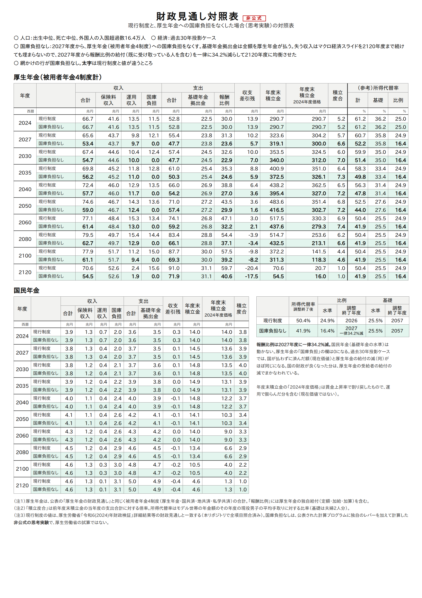
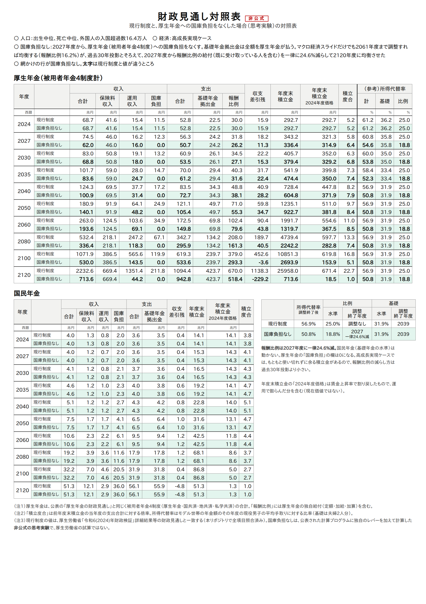
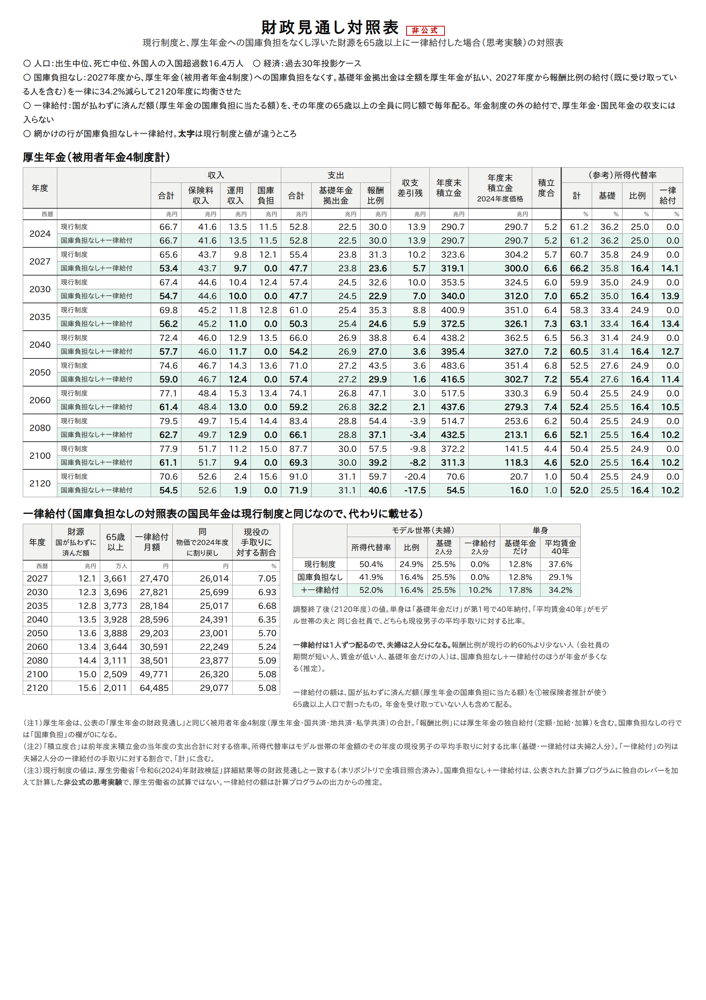
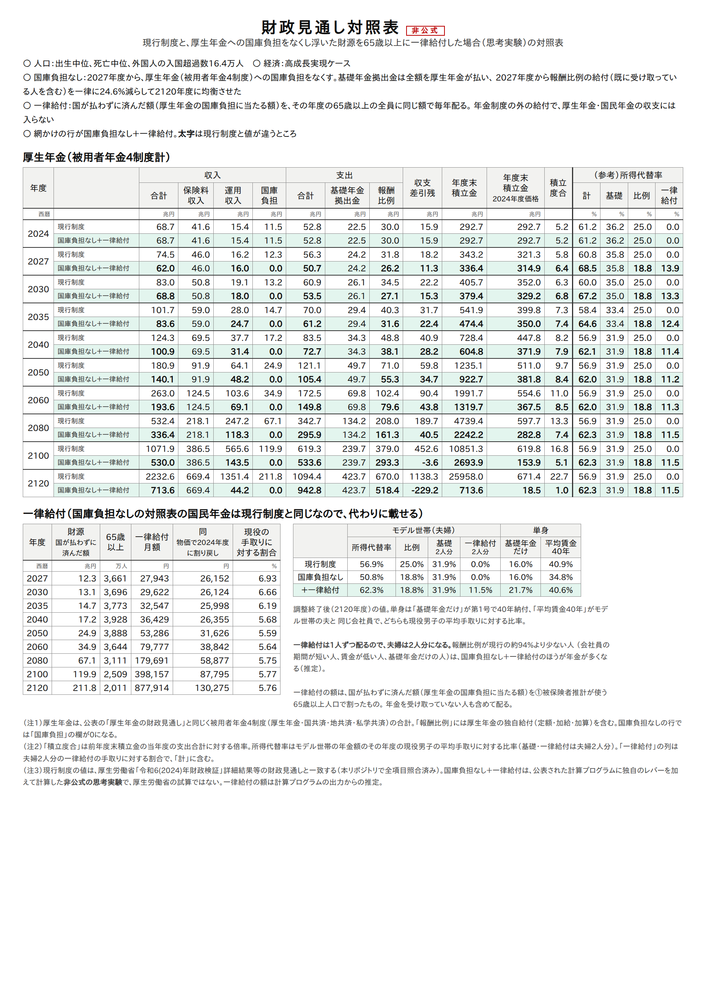

# 厚生年金の国庫負担を廃止して、65歳以上に一律給付したら — 財政検証の計算プログラムで確かめた

厚生年金には、毎年12兆円ほどの国庫負担（税金）が入っている。これをなくしたら、
厚生年金はどうなり、国の財政はどれだけ良くなるのか。さらに、浮いた財源を65歳以上の全員に
同じ額で配ったら、1人いくらになり、誰の年金が増えて誰の年金が減るのか。
厚生労働省が公表している2024年財政検証の計算プログラムを動かして確かめた。

**結論：国庫負担をなくすと、厚生年金は基礎年金拠出金を全額自分で払うことになり、
報酬比例の年金を過去30年投影ケースで約34%、高成長実現ケースで約25%減らさないと
2120年度に均衡しない。国の財政は2027〜2100年度の累計で名目約1,020兆円
（現在価値で約366兆円）良くなる（過去30年投影）。ただし、その分はそっくり
厚生年金の受給者の給付の減になっている。**

**浮いた財源を65歳以上の全員に同じ額で配ると、1人あたり月2.7万円（2027年度）になる。
今の物価に直すと月2.2万〜2.6万円で、現役の手取りの5〜7%に当たる。モデル世帯（夫婦）の所得代替率は
現行制度の50.4%から52.0%に上がり、基礎年金だけの人は12.8%から17.8%に上がる（過去30年投影）。
年金が減るのは、会社員の期間が長く賃金が高い単身の人である。**

以下は**非公式の思考実験**で、厚生労働省の試算ではない。

---

## 1. 厚生年金の国庫負担とは何か

厚生年金の「国庫負担」は、ほぼ全部が**基礎年金拠出金の半分**である。

- 基礎年金の給付費の1/2は国庫が持つ（[国庫負担.md](../国庫負担.md)）
- 厚生年金は、加入者の頭数に応じた基礎年金拠出金を払う。その半分に国庫負担が付いてくる
  （[基礎年金拠出金.md](../基礎年金拠出金.md)）

過去30年投影ケース（現行制度）の2027年度では、次のとおりである。

| | 額 |
|---|---|
| 厚生年金（被用者年金4制度計）の基礎年金拠出金 | 23.8兆円 |
| 同じく国庫負担 | **12.1兆円**（うち民間の厚生年金だけで10.9兆円） |

国庫負担をなくすということは、**厚生年金が拠出金を国の分まで全額払う**、つまり
今の倍の額を自分の保険料と積立金から出すということになる。

## 2. 何を計算したか

公表された計算プログラム（C/C++）の⑤厚生年金の収支計算に、レバーを1つ足した
（`KOKKO`）。

- 2027年度から、被用者年金4制度（厚生年金・国共済・地共済・私学共済）の国庫負担を
  収入に入れない
- 基礎年金拠出金は今までどおり払う
- 国民年金（基礎年金の水準を決める財布）には触らない。**基礎年金の水準は変わらない**
- 保険料率（18.3%）は変えない

賃金・物価・人口などの前提は、公式の過去30年投影ケース・高成長実現ケースのまま動かしていない。

## 3. マクロ経済スライドだけでは足りない（過去30年投影）

まず、今のルールどおり**マクロ経済スライドで報酬比例を下げる**だけで帳尻が合うかを見た。

| | 過去30年投影 | 高成長実現 |
|---|---|---|
| 報酬比例の調整が終わる年度 | **均衡しない**（2120年度まで調整しても足りない） | 2061年度（現行は調整なし） |
| 厚生年金の積立金 | **2061年度にマイナス**、2120年度末に −1,552兆円 | 2120年度末 712兆円（1年分） |
| 所得代替率（2120年度） | 33.2%（うち比例 7.7%） | 48.1%（うち比例 16.2%） |

過去30年投影では、報酬比例を2120年度まで毎年削り続け、所得代替率で7.7%まで
下げても積立金が2061年度に底をつく。失う収入が年12〜15兆円あるのに、マクロ経済スライドは
年1%前後しか下げられないうえに、**すでに受け取っている人の年金は名目では下げない**
（名目下限）からである。計算プログラム自身も「最終年度まで調整しても均衡できませんでした」
と出して止まる。

高成長実現では、スライドを2061年度まで続ければ均衡する。

## 4. 報酬比例を一律に削って均衡させる

そこで、2027年度から**報酬比例の年金を一律に何%削れば**2120年度に均衡するかを求めた。
すでに年金を受け取っている人も含めて同じ割合で削る。今のルールではできない削り方で、
あくまで「国庫負担の穴がどれだけの大きさか」を測るための物差しである。
両ケースとも同じ方法で計算した。

| | 過去30年投影 | 高成長実現 |
|---|---|---|
| 報酬比例の削減 | **一律 34.2%減** | **一律 24.6%減** |
| 所得代替率（調整終了後） | 50.4% → **41.9%** | 56.9% → **50.8%** |
| 　うち報酬比例 | 24.9% → 16.4% | 25.0% → 18.8% |
| 　うち基礎年金 | 25.5%（変わらず） | 31.9%（変わらず） |
| 2027年度の所得代替率 | 60.7% → 52.2% | 60.8% → 54.6% |

## 5. 国の財政はどれだけ良くなるか

国が払わずに済んだ額（厚生年金の国庫負担）を足し上げた。現在価値は、それぞれのケースの
名目運用利回りで2024年度末に割り引いた値である。

| | 過去30年投影 | 高成長実現 |
|---|---|---|
| 国の財政が良くなる額　2027〜2100年度・名目 | **約1,020兆円** | 約3,570兆円 |
| 　同・現在価値 | **約366兆円** | 約398兆円 |
| 国の財政が良くなる額　2027〜2120年度・現在価値 | 約389兆円 | 約432兆円 |
| 厚生年金の受給者の給付の減　2027〜2120年度・現在価値 | 約389兆円 | 約277兆円 |

名目の累計は賃金の伸び（過去30年投影で年1.3%程度、高成長実現で年4%程度）で膨らむので、
比べるときは現在価値で見る。

### 国の得は、受給者の損と裏表

過去30年投影では、国が得した額（現在価値389兆円）と、厚生年金の受給者が失った額
（同389兆円）がほぼ同じになる。お金がどこかから湧いてきたのではなく、
**税でまかなっていた基礎年金の費用を、厚生年金の受給者に付け替えた**だけである。

高成長実現では、受給者の損（277兆円）が国の得（432兆円）より約155兆円小さい。
高成長実現の現行制度には、2120年度までに使い切れずに余る積立金（現在価値で約157兆円、
[運用利回りと保険料.md](運用利回りと保険料.md)）がある。国庫負担の穴の一部は、
この余りで埋まっていると考えられる（推定）。

## 6. 財政見通し対照表





厚生年金の表で「国庫負担」の欄が0になり、支出の「報酬比例」が減っている。
国民年金の表は現行制度と1ビットも違わない（基礎年金の水準は動かない）。

## 7. 浮いた財源を65歳以上に一律給付したら

国が払わずに済んだ額（厚生年金の国庫負担に当たる額）を、その年度の65歳以上の全員に同じ額で毎年配る。
年金制度の外の給付として考え、厚生年金・国民年金の収支には入れない。国の財政は、国庫負担をなくす前と
同じになる（浮いた分をそのまま配る）。65歳以上の人数は、計算プログラムの①被保険者推計が使う人口
（出生中位・死亡中位）から取った。年金を受け取っていない人も含めて配る。

### 1人あたりの月額

| 年度 | 過去30年投影：月額 | 同：今の物価で | 同：現役の手取りに対する割合 | 高成長実現：月額 | 同：今の物価で | 同：手取りに対する割合 |
|---|---|---|---|---|---|---|
| 2027 | **27,470円** | 26,014円 | 7.05% | **27,943円** | 26,152円 | 6.93% |
| 2040 | 28,596円 | 24,391円 | 6.35% | 36,429円 | 26,355円 | 5.68% |
| 2060 | 30,591円 | 22,249円 | 5.24% | 79,777円 | 38,842円 | 5.64% |
| 2100 | 49,771円 | 26,320円 | 5.08% | 398,157円 | 87,795円 | 5.77% |

- 「今の物価で」は、物価で2024年度に割り戻した額
- 国庫負担は基礎年金拠出金の半分なので、賃金とともに伸びる。そのため、一律給付は現役の手取りのおよそ5〜7%で安定する。
  高成長実現で名目額が大きく伸びるのは、賃金が年4%ほど伸びるためである

### 所得代替率に組み込むと

2120年度（調整終了後）の値。一律給付は1人ずつ配るので、夫婦は2人分になる。単身は、
「基礎年金だけ」が第1号で40年納付した人、「平均賃金40年」がモデル世帯の夫と同じ会社員である。
どちらも現役男子の平均手取りに対する比率で表す。

| | 過去30年投影 | 高成長実現 |
|---|---|---|
| モデル世帯（夫婦）：現行 → 国庫負担なし → **＋一律給付** | 50.4% → 41.9% → **52.0%** | 56.9% → 50.8% → **62.3%** |
| 基礎年金だけの単身 | 12.8% → 12.8% → **17.8%** | 16.0% → 16.0% → **21.7%** |
| 平均賃金40年の単身 | 37.6% → 29.1% → **34.2%** | 40.9% → 34.8% → **40.6%** |

- **年金が増える人**：基礎年金だけの人、夫婦世帯、会社員の期間が短い人、賃金が低い人
- **年金が減る人**：会社員の期間が長く賃金が高い単身の人。損得がつり合うのは、報酬比例が
  モデル世帯の夫の約6割（過去30年投影）、約9割5分（高成長実現）のときである（推定）

国の財政は変わらないまま、**報酬比例（賃金に比例する部分）の一部を、1人いくらの同じ額に組み替えた**のと
同じことになる。所得の再分配が強くなる。





## 8. 読むときの注意

- **非公式の思考実験である。** 公表された計算プログラムに独自のレバーを加えて計算した
- **一律削減は今のルールではできない。** 名目下限の下では、すでに受け取っている人の年金を
  名目で3割下げることはできない。「国庫負担の穴の大きさ」を測る物差しとして読む
- **保険料を上げる道もある。** ここでは保険料率を18.3%のまま据え置いた。
  報酬比例を削らずに保険料で埋める設計は計算していない
- **被用者年金4制度の合計である。** 民間の厚生年金だけなら、2027年度の国庫負担は10.9兆円
- **国の財政の改善は、年金の国庫負担が減る分だけを数えた。** 年金が減ることで生活保護など
  ほかの支出が増えるかは入れていない
- **一律給付は、毎年その年に浮いた分をその年に配る。** 積み立てはしない。税・所得制限・
  生活保護との関係は入れていない。月額は計算プログラムの出力からの推定である

## 9. 再現

```sh
python3 勉強/応用編/国庫負担の廃止.py run 3003        # 過去30年投影（④⑤を2回流す）
python3 勉強/応用編/国庫負担の廃止.py run 3001        # 高成長実現
python3 勉強/応用編/国庫負担の廃止.py report          # 上の表の数字
python3 勉強/応用編/国庫負担の廃止.py table 3003 3001 # 対照表（図/）
python3 勉強/応用編/国庫負担の廃止.py ichiritsu        # 一律給付の月額と所得代替率
python3 勉強/応用編/国庫負担の廃止.py ichiritsu-table 3003 3001  # 一律給付の対照表（図/）
```

- 予備番号701が一律削減、702がマクロ経済スライドだけの場合
- レバーの本体は [検証/実行/patches/kokko-cut.patch](../../検証/実行/patches/kokko-cut.patch)。
  [検証/実行/run_pipeline.sh](../../検証/実行/run_pipeline.sh) の `KOKKO`・`KOKKO_MODE` で使う
- レバーを当てたビルドでも、`KOKKO` を指定しなければ通常試算と全項目が一致することを確かめてある

---

*計算：厚生労働省「令和6(2024)年財政検証」公表の計算プログラムを、有志のリポジトリで
ビルド・実行したもの。現行制度の財政見通しは公表値と全項目一致。国庫負担をなくした
シナリオと一律給付は非公式の思考実験。*
