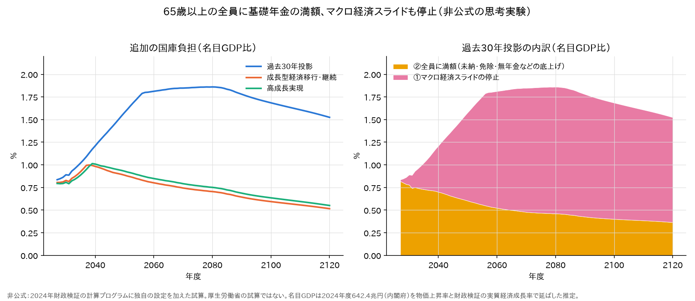

# 基礎年金を65歳以上の全員に満額にしたら — スライドも止めて、国庫で

65歳以上なら誰でも、基礎年金を満額で受け取れるようにする。未納・免除の期間があって減額されている人も、
加入期間が短い人も、受給資格が無い人も、満額まで引き上げる。あわせて、基礎年金のマクロ経済スライドを止める。
保険料は今のまま。増えた給付は全部、国庫負担を足してまかなう。

国庫負担をどれだけ足せばよいかを、2024年財政検証の計算プログラムで試算する。

**結論**
- 追加の国庫負担は、2027年度で**年5.6〜5.7兆円**（名目GDPの約0.8%）になる。
  ほぼ全部が「全員に満額」の分（未納・免除・無年金などの底上げ）である
- 過去30年投影では、スライドを止めた分が年々重くなる。追加は2060年度に**年15.2兆円（GDPの1.8%）**。
  基礎年金の費用のうち国庫が持つ割合は、今の5割から**7割近く**になる
- 成長するケース（成長型経済移行・継続、高成長実現）は、スライドがもともと2030年代に終わるので軽い。
  追加はGDPの1%以下で、だんだん下がる
- 2027〜2120年度の現在価値は、**過去30年投影344兆円、成長型210兆円、高成長実現241兆円**
- 所得代替率はどのケースも**約61%**にそろう（基礎36.0%＋比例は今のまま）。基礎年金だけの単身は**18.0%**
- 保険料は変えないので、報酬比例と厚生年金の財政は現行制度のままである

以下は、厚生労働省の試算ではない**非公式の思考実験**である。

---

## 1. 設計

| 項目 | 設定 |
|---|---|
| 基礎年金 | 2027年度から、**65歳以上の全員に満額**。納付期間は問わない |
| マクロ経済スライド | 2027年度から、**基礎年金だけ止める**。2026年度までに下がった分はそのまま |
| 満額の改定 | 今のルールどおり。67歳以下は賃金、68歳以上は物価に合わせて改定する |
| 保険料 | **現行制度のまま**（国民年金保険料も、厚生年金保険料率18.3%も） |
| 財源 | 増えた給付は全部、**国庫負担を追加**してまかなう。税目は決めない |

- 各制度（国民年金・厚生年金・共済）が払う基礎年金拠出金のうち、保険料でまかなう分は現行制度のまま据え置く。
  増えた分は国庫が持つので、**厚生年金の財政と報酬比例は現行制度と変わらない**
- 障害・遺族の基礎年金も、スライドを止めた水準にする
- 68歳以上の満額は物価で改定されるので、生まれた年度で少しずつ違う。
  過去30年投影の2060年度（名目・月額）で、67歳10.4万円、85歳9.5万円である。
  「満額」は、その人の年齢での満額を指す

## 2. 誰が底上げされるか

| 今の制度で満額に届かない人 | この設計 |
|---|---|
| 未納の期間があって減額されている人 | 満額まで引き上げ |
| 免除の期間があって減額されている人（全額免除の期間は2分の1で計算） | 満額まで引き上げ |
| 加入期間が短い人（学生のころ任意加入だった世代、海外にいた期間がある人など） | 満額まで引き上げ |
| 受給資格（10年）に届かない無年金の人 | 満額を新しく支給 |
| 繰上げ受給で減額されている人 | 65歳からは満額 |

厚生年金を受け取っている人も、基礎年金の部分が満額より少なければ満額まで上がる。報酬比例はそのまま。

今の制度で、65歳以上の人口に対して**満額に換算した受給者は82%**（2027年度）しかいない。
残りの18%、約660万人分（65歳以上3,661万人）を満額に引き上げるのが「②全員に満額」の費用である。
1986年以降に制度に入った世代が高齢者の中心になるにつれて、この割合は91%（2100年度）まで上がる。

## 3. 結果：追加で要る国庫負担



金額は名目。「国庫の割合」は、基礎年金の給付費のうち国庫負担（特別国庫負担を含む）が持つ割合で、左が現行制度、右がこの設計である。
消費税に換算した値は、2025年度決算の国の消費税収26.0兆円（税率7.8%分）から1ポイントあたり3.3兆円とし、
賃金総額の伸びで延ばした参考値である。

### 過去30年投影

| 年度 | 現行の給付費 | 新しい給付費 | 追加の国庫 | うち①スライド停止 | うち②全員に満額 | 対GDP | 国庫の割合 | 消費税に換算 |
|---|---|---|---|---|---|---|---|---|
| 2027 | 27.4兆円 | 32.9兆円 | **5.6兆円** | 0.1兆円 | 5.4兆円 | 0.84% | 51% → 59% | 1.6ポイント |
| 2030 | 28.1兆円 | 34.1兆円 | **6.0兆円** | 0.7兆円 | 5.3兆円 | 0.89% | 51% → 60% | 1.7ポイント |
| 2040 | 30.9兆円 | 39.7兆円 | **8.8兆円** | 3.7兆円 | 5.1兆円 | 1.21% | 51% → 62% | 2.4ポイント |
| 2050 | 31.4兆円 | 43.7兆円 | **12.3兆円** | 7.6兆円 | 4.7兆円 | 1.58% | 52% → 65% | 3.4ポイント |
| 2060 | 31.0兆円 | 46.1兆円 | **15.2兆円** | 10.8兆円 | 4.4兆円 | 1.81% | 52% → 68% | 4.0ポイント |
| 2080 | 33.3兆円 | 51.2兆円 | **17.9兆円** | 13.5兆円 | 4.4兆円 | 1.86% | 52% → 69% | 4.6ポイント |
| 2100 | 34.7兆円 | 53.3兆円 | **18.6兆円** | 14.2兆円 | 4.4兆円 | 1.68% | 52% → 69% | 4.6ポイント |
| 2120 | 36.0兆円 | 55.4兆円 | **19.4兆円** | 14.7兆円 | 4.6兆円 | 1.52% | 52% → 69% | 4.7ポイント |

### 成長型経済移行・継続

| 年度 | 現行の給付費 | 新しい給付費 | 追加の国庫 | うち①スライド停止 | うち②全員に満額 | 対GDP | 国庫の割合 | 消費税に換算 |
|---|---|---|---|---|---|---|---|---|
| 2027 | 27.7兆円 | 33.4兆円 | **5.7兆円** | 0.1兆円 | 5.6兆円 | 0.80% | 51% → 59% | 1.6ポイント |
| 2030 | 29.6兆円 | 36.0兆円 | **6.4兆円** | 0.8兆円 | 5.6兆円 | 0.83% | 51% → 60% | 1.7ポイント |
| 2040 | 38.5兆円 | 48.9兆円 | **10.3兆円** | 3.9兆円 | 6.4兆円 | 0.98% | 51% → 62% | 2.0ポイント |
| 2050 | 52.6兆円 | 65.3兆円 | **12.7兆円** | 5.3兆円 | 7.3兆円 | 0.89% | 52% → 61% | 2.0ポイント |
| 2060 | 70.4兆円 | 86.0兆円 | **15.6兆円** | 7.1兆円 | 8.4兆円 | 0.80% | 52% → 60% | 1.9ポイント |
| 2080 | 122.7兆円 | 148.0兆円 | **25.3兆円** | 12.4兆円 | 12.9兆円 | 0.70% | 52% → 60% | 1.9ポイント |
| 2100 | 198.4兆円 | 237.9兆円 | **39.5兆円** | 20.1兆円 | 19.4兆円 | 0.59% | 52% → 60% | 1.9ポイント |
| 2120 | 318.0兆円 | 381.4兆円 | **63.4兆円** | 32.2兆円 | 31.2兆円 | 0.52% | 52% → 60% | 1.9ポイント |

### 高成長実現

| 年度 | 現行の給付費 | 新しい給付費 | 追加の国庫 | うち①スライド停止 | うち②全員に満額 | 対GDP | 国庫の割合 | 消費税に換算 |
|---|---|---|---|---|---|---|---|---|
| 2027 | 27.7兆円 | 33.4兆円 | **5.7兆円** | 0.1兆円 | 5.6兆円 | 0.79% | 51% → 59% | 1.6ポイント |
| 2030 | 29.7兆円 | 36.1兆円 | **6.4兆円** | 0.8兆円 | 5.7兆円 | 0.81% | 51% → 60% | 1.6ポイント |
| 2040 | 38.6兆円 | 50.0兆円 | **11.5兆円** | 4.8兆円 | 6.6兆円 | 1.01% | 51% → 63% | 2.1ポイント |
| 2050 | 56.1兆円 | 71.3兆円 | **15.1兆円** | 7.1兆円 | 8.1兆円 | 0.93% | 52% → 62% | 2.1ポイント |
| 2060 | 79.1兆円 | 98.8兆円 | **19.7兆円** | 10.0兆円 | 9.8兆円 | 0.85% | 52% → 61% | 2.0ポイント |
| 2080 | 152.0兆円 | 187.6兆円 | **35.6兆円** | 19.1兆円 | 16.5兆円 | 0.75% | 52% → 61% | 2.1ポイント |
| 2100 | 271.5兆円 | 332.9兆円 | **61.5兆円** | 34.1兆円 | 27.3兆円 | 0.64% | 52% → 61% | 2.0ポイント |
| 2120 | 479.6兆円 | 588.4兆円 | **108.8兆円** | 60.3兆円 | 48.5兆円 | 0.55% | 52% → 61% | 2.1ポイント |

### まとめ（現在価値は2024年度末に割り引き）


| | 過去30年投影 | 成長型経済移行・継続 | 高成長実現 |
|---|---|---|---|
| 追加の国庫（2027年度） | 5.6兆円（GDPの0.84%） | 5.7兆円（GDPの0.80%） | 5.7兆円（GDPの0.79%） |
| 追加の国庫（2060年度） | 15.2兆円（1.81%） | 15.6兆円（0.80%） | 19.7兆円（0.85%） |
| 現在価値（2027〜2120年度） | **344兆円** | **210兆円** | **241兆円** |
| 　うち①スライド停止 | 206兆円 | 80兆円 | 103兆円 |
| 　うち②全員に満額 | 139兆円 | 130兆円 | 138兆円 |
| 2024年度GDPに対する割合 | 54% | 33% | 38% |
| 所得代替率（2060年度） | 50.4% → **60.8%** | 57.6% → **60.9%** | 56.9% → **60.9%** |
| 　うち基礎（夫婦） | 25.5% → 36.0% | 32.6% → 36.0% | 31.9% → 36.0% |
| 基礎年金だけの単身 | 12.8% → **18.0%** | 16.3% → **18.0%** | 16.0% → **18.0%** |
| 満額に換算した受給者の割合（現行） | 2027年度 82% → 2100年度 91% | 2027年度 82% → 2100年度 91% | 2027年度 82% → 2100年度 91% |

割引率は、ほかの応用編と同じく経済前提の名目運用利回りである。

## 4. 読み方

### 最初は「全員に満額」、長い目では「スライド停止」

2027年度の追加5.6兆円のうち、5.4兆円は②全員に満額である。スライドは2026年度までに1.7%しか
効いていないので、止めても最初の差は小さい。

過去30年投影では、現行制度の基礎年金は2057年度までスライドで下がり続ける（満額換算でおよそ3割減）。
それを止めた差が年々開き、2060年度には追加15.2兆円のうち10.8兆円が①スライド停止になる。
一方、②は受給者の加入記録がそろっていくので、4〜5兆円で横ばいになる。

### 成長するケースは軽い

成長型経済移行・継続と高成長実現では、基礎年金のスライドがもともと2037〜2039年度で終わる。
止める効果は小さく、追加の国庫はGDPの0.5〜1.0%で推移する。
金額は名目GDPとともに増えるが、GDP比はだんだん下がる。

### 所得代替率は約61%にそろう

スライドを止めると、基礎年金の所得代替率（夫婦）は36.0%で横ばいになる（2040・2060・2120年度で確かめた）。
報酬比例は現行制度のまま（24.9〜25.0%）なので、どのケースも所得代替率は約61%になる。
基礎年金だけの単身は18.0%で、過去30年投影の現行制度（12.8%）より4割高い。

### ほかの応用編との違い

| | この設計 | [一律7万円・所得税方式](一律7万円・所得税方式.md) | [税方式・赤字国債](基礎年金を税方式にして赤字国債でまかなったら.md) |
|---|---|---|---|
| 給付 | 全員に満額、スライド停止 | 全員に月7万円（賃金に連動） | 現行のまま |
| 68歳以上の改定 | 物価（今のルール） | 賃金 | 今のルール |
| 保険料 | **現行のまま** | 国民年金0、厚生年金13.07% | 国民年金0、厚生年金13.07% |
| 国の追加負担（過去30年投影、2027年度） | **5.6兆円** | 19.0兆円（所得税） | 13.4兆円（国債） |

一律7万円・所得税方式の追加19.0兆円は、給付を増やす分（約5兆円）と保険料を置き換える分（約14兆円）でできていた。
この設計は保険料を残すので、**給付を増やす分だけ**を国庫で持つ。

## 5. 計算のしかた

- **①スライド停止**は、計算プログラムの④（基礎年金）で計算した。
  - 通常試算のカット率（マクロ経済スライドで下げる率）を2026年度で据え置いたファイルを作り、
    ④の「カット率を外から与える」経路（`CUT_KOTEI=1`、調整期間の一致の2周目が使う経路）で読ませた（予備番号951）
  - この経路に通常試算のカット率をそのまま読ませると、基礎年金給付費・拠出金・国庫負担は
    通常試算と相対差1e-14で一致する
  - ただしこの経路では、国民年金勘定の「年度末積立金」に調整前の値が出る（[原本の不具合.md](../../検証/原本の不具合.md) L1）。
    この試算は積立金を使わない
- **②全員に満額**は推定である。65歳以上の年齢別人口（①被保険者推計の人口、男女計）に、
  年齢別の満額（スライドを止めたもの）を掛けて足し、①で計算した老齢基礎年金の給付費を引いた
  - 年齢別の満額は③（国民年金）の値から作った。③が出力する年齢別の満額の表は、年齢の添字が67ずれていて、
    全部の列に67歳以下の値が出る（[原本の不具合.md](../../検証/原本の不具合.md) J4）。
    そこで、先頭の列（67歳以下）と、③が生の年齢で書く単年度の改定率（`KOKUKAITE`）から、68歳以上を1年ずつ組み立てた。
    高成長実現の2040年度の68歳は、J4に載っている本当の値と12桁一致する
- **追加の国庫** ＝（65歳以上の満額の合計 ＋ スライドを止めた障害・遺族の基礎年金）− 現行制度の基礎年金給付費
- **所得代替率**は、⑤の通常試算のモデル年金の基礎年金を、カット率の比（据え置き ÷ 現行）で直した

## 6. 前提と注意（推定の部分）

- **繰上げ・繰下げ。** 65歳以上は全員ちょうど満額とした。60〜64歳の繰上げ受給と、繰下げの増額は考えていない。
  65歳を過ぎて繰下げを待っている人にも、65歳から満額を払う計算になっている
- **障害基礎年金との重なり。** 65歳以上で障害基礎年金を受け取っている人にも、満額と障害基礎年金の両方を数えている。
  その分だけ多めに出ている。④の出力は障害基礎年金を年齢で分けていないので、大きさは出せない
- **生活保護。** 65歳以上の生活保護世帯は、年金が増えると保護費が減る。国の支出には相殺される分があるが、この試算には入れていない
- **人口の範囲。** ①の将来推計人口（男女計）を使った。居住要件（海外に住む人、日本に住む外国人）は決めていない
- **名目GDP**は[税方式・赤字国債](基礎年金を税方式にして赤字国債でまかなったら.md)と同じ推定の系列
  （2024年度642.4兆円を、物価上昇率と財政検証の実質経済成長率で延ばしたもの）

## 7. 再現

```sh
python3 勉強/応用編/全員に満額.py run      # ④を3ケース流す（予備番号951。④がビルド済みであること）
python3 勉強/応用編/全員に満額.py check    # 固定カット率の経路が通常試算を再現するか
python3 勉強/応用編/全員に満額.py report   # 上の表
python3 勉強/応用編/全員に満額.py graph    # 図（勉強/応用編/図/全員に満額_追加の国庫.png）
```

- 通常試算（予備番号000）の3001〜3003が要る
- ⑤は流さない（厚生年金の財政は現行制度と変わらないため）

---

*計算：厚生労働省「令和6(2024)年財政検証」公表の計算プログラムを、有志のリポジトリで
ビルド・実行したもの。全員に満額・スライド停止は、計算プログラムに独自の設定を加えた非公式の計算で、
厚生労働省の試算ではない。*

*出典：名目GDPは内閣府経済社会総合研究所
「[2024年度（令和6年度）国民経済計算 年次推計（支出側系列等）（2020年（令和2年）基準改定値）](https://www.esri.cao.go.jp/jp/sna/data/data_list/kakuhou/gaiyou/pdf/point_20251208.pdf)」、
実質経済成長率は厚生労働省「[令和6(2024)年財政検証結果の概要](https://www.mhlw.go.jp/content/001270476.pdf)」、
消費税収は財務省「[一般会計税収の推移](https://www.mof.go.jp/tax_policy/summary/condition/010.pdf)」。*
