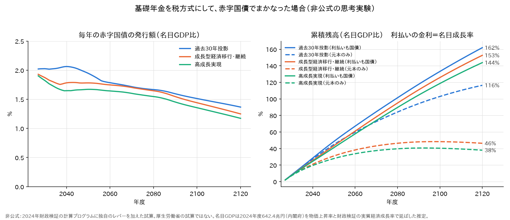

# 基礎年金を税方式にして、赤字国債でまかなったら

基礎年金の保険料をやめて、基礎年金を全額国のお金で払う「税方式」にする。
ただし、どの税を上げるかは決めない。足りない分は、毎年**赤字国債**を出して積み上げる。
給付は今の制度のまま変えない。

[一律7万円・所得税方式](一律7万円・所得税方式.md)は、給付を変えて財源を所得税に求めた。
ここでは給付も税も動かさず、**保険料を国の借金に付け替えるだけ**にする。
いくら借りることになるかを、2024年財政検証の計算プログラムで試算する。

**結論**
- 赤字国債は、2027年度で**年13〜14兆円**になる。**名目GDPの約2%** である。
  GDP比は少しずつ下がり、2120年度で1.2〜1.4%になる（マクロ経済スライドで基礎年金が経済より細るため）
- 2027〜2120年度の発行額を合計して現在価値にすると、**434兆円（過去30年投影）〜473兆円（高成長実現）** になる。
  2024年度GDPの**7割前後**である
- 累積残高は、利払いも国債でまかなうと、2120年度に**名目GDPの1.4〜1.6倍**になる（金利を名目成長率と同じとした場合）。
  元本だけなら、過去30年投影で1.2倍、成長するケースで0.4〜0.5倍
- 国の借金は、廃止した保険料とほぼ同じ額になる（過去30年投影の現在価値で434兆円と430兆円）。
  給付は増えないので、**負担の総額は変わらず、払う人が今の加入者から将来の納税者へ移る**

以下は、厚生労働省の試算ではない**非公式の思考実験**である。

---

## 1. 設計

| 項目 | 税方式・赤字国債 |
|---|---|
| 給付 | **現行制度のまま**。基礎年金も報酬比例も、マクロ経済スライドも今どおり |
| 国民年金保険料 | 2027年度から**廃止** |
| 厚生年金保険料 | 基礎年金に当たる分（基礎年金拠出金の負担）を下げる。報酬比例は現行制度のまま |
| 国の負担 | 基礎年金拠出金を**全額**負担する（今は半分） |
| 財源 | 決めない。今の国庫負担との差を、毎年**赤字国債**で出す |

- 毎年の赤字国債の額は、次の式で出した（④の出力）

  > 発行額 ＝ 基礎年金拠出金の合計 − 基礎年金拠出金の国庫負担（今の2分の1）

  つまり、拠出金のうち保険料でまかなっていた分である。特別国庫負担（免除期間の分など）は今と同じなので、差には入らない
- 厚生年金保険料の下げ幅は、[一律7万円・所得税方式](一律7万円・所得税方式.md)と同じ計算で求めた
  （⑤の `ZEI` レバー、予備番号901）。厚生年金は基礎年金拠出金を払わず、基礎年金の国庫負担も受け取らない。
  報酬比例と2120年度の積立度合を現行制度のままにして、下げられる保険料率を出した
  - 過去30年投影：18.3% → **13.07%**（5.23ポイント下げ）
  - 高成長実現：18.3% → **12.53%**（5.77ポイント下げ）
- 給付が変わらないことは、計算で確かめた。所得代替率（2120年度）は、どちらのケースも通常試算と全桁一致する
  （過去30年投影 50.3915%、高成長実現 56.9122%）

## 2. 結果：毎年の発行額と累積残高



金額は名目、GDP比はその年度の名目GDPに対する割合である。
「利払い込み」は、利払いも毎年新しい国債でまかなった場合の残高である。

### 過去30年投影

| 年度 | 発行額 | 対GDP | 累積（元本） | 累積÷GDP | 利払い込み（金利＝名目成長率 0.7%） | 利払い込み（金利＝運用利回り 3.0%） |
|---|---|---|---|---|---|---|
| 2027 | 13.4兆円 | 2.02% | 13兆円 | 2% | 2% | 2% |
| 2030 | 13.8兆円 | 2.03% | 54兆円 | 8% | 8% | 8% |
| 2040 | 15.0兆円 | 2.06% | 198兆円 | 27% | 28% | 33% |
| 2050 | 15.2兆円 | 1.95% | 350兆円 | 45% | 49% | 64% |
| 2060 | 14.9兆円 | 1.79% | 500兆円 | 60% | 67% | 101% |
| 2080 | 16.0兆円 | 1.67% | 809兆円 | 84% | 101% | 202% |
| 2100 | 16.7兆円 | 1.51% | 1,138兆円 | 103% | 133% | 358% |
| 2120 | 17.4兆円 | 1.37% | **1,480兆円** | **116%** | **162%** | **601%** |

### 成長型経済移行・継続

| 年度 | 発行額 | 対GDP | 累積（元本） | 累積÷GDP | 利払い込み（金利＝名目成長率 3.1%） | 利払い込み（金利＝運用利回り 5.3%） |
|---|---|---|---|---|---|---|
| 2027 | 13.6兆円 | 1.93% | 14兆円 | 2% | 2% | 2% |
| 2030 | 14.5兆円 | 1.87% | 56兆円 | 7% | 8% | 8% |
| 2040 | 18.7兆円 | 1.78% | 221兆円 | 21% | 26% | 29% |
| 2050 | 25.5兆円 | 1.78% | 444兆円 | 31% | 43% | 55% |
| 2060 | 34.0兆円 | 1.75% | 744兆円 | 38% | 61% | 87% |
| 2080 | 59.2兆円 | 1.65% | 1,667兆円 | 46% | 95% | 174% |
| 2100 | 95.8兆円 | 1.44% | 3,212兆円 | 48% | 126% | 300% |
| 2120 | 153.6兆円 | 1.25% | **5,697兆円** | **46%** | **153%** | **485%** |

### 高成長実現

| 年度 | 発行額 | 対GDP | 累積（元本） | 累積÷GDP | 利払い込み（金利＝名目成長率 3.6%） | 利払い込み（金利＝運用利回り 5.5%） |
|---|---|---|---|---|---|---|
| 2027 | 13.6兆円 | 1.90% | 14兆円 | 2% | 2% | 2% |
| 2030 | 14.5兆円 | 1.82% | 56兆円 | 7% | 7% | 8% |
| 2040 | 18.8兆円 | 1.65% | 222兆円 | 19% | 24% | 27% |
| 2050 | 27.2兆円 | 1.67% | 453兆円 | 28% | 41% | 51% |
| 2060 | 38.2兆円 | 1.64% | 783兆円 | 34% | 58% | 78% |
| 2080 | 73.4兆円 | 1.55% | 1,881兆円 | 40% | 90% | 149% |
| 2100 | 131.1兆円 | 1.36% | 3,905兆円 | 40% | 119% | 247% |
| 2120 | 231.8兆円 | 1.17% | **7,498兆円** | **38%** | **144%** | **381%** |

### 現在価値（2024年度末に割り引き）

| 経済前提 | 2027〜2120年度の発行額の合計 | 2024年度GDPに対する割合 | （参考）同じ期間に廃止する保険料 |
|---|---|---|---|
| 過去30年投影 | **434兆円** | 68% | 430兆円 |
| 成長型経済移行・継続 | **449兆円** | 70% | ― |
| 高成長実現 | **473兆円** | 74% | 530兆円 |

割引率は、ほかの応用編と同じく経済前提の名目運用利回りである。

## 3. 読み方

### 毎年の発行額は、GDPの2%弱で頭打ち

発行額のGDP比は、2027年度の約2%から、2120年度には1.2〜1.4%に下がる。
基礎年金はマクロ経済スライドで経済の伸びより小さくなっていくので、それに合わせて国債も細る。
毎年の発行額が膨らみ続けることはない。

### 重いのは積み上がり

どのケースでも、毎年GDPの2%弱を100年近く足し続ける。
金利が名目成長率と同じなら、残高のGDP比は毎年のGDP比を足したものになるので、2120年度に**1.4〜1.6倍**になる。
経済前提による差は小さい。

- **元本だけ**なら、成長するケースは軽い（0.4〜0.5倍）。GDPが名目で年3%以上伸びるので、昔の国債が相対的に小さくなる。
  過去30年投影は名目成長率が0.7%しかないので、元本だけでも1.2倍になる
- **金利が年金の運用利回りくらい**（名目成長率より1.8〜2.3ポイント高い）だと、どのケースでも残高がGDPより速く増えて、発散する。
  過去30年投影では、2120年度の利払いが年223兆円になり、その年度の発行額（17兆円）の13倍になる

### 負担が消えるわけではない

国の借金は、廃止した保険料とほぼ同じ額になる。過去30年投影では、現在価値で国債434兆円、保険料430兆円である。
給付は1円も増えていない。変わるのは、**誰がいつ払うか**だけである。

- 今は：その年度の加入者が、保険料で払う
- この設計では：将来の納税者が、国債の元本と利払いで払う

[一律7万円・所得税方式](一律7万円・所得税方式.md)では、2027年度の追加の税19.0兆円のうち、約14兆円が「保険料の置き換え」だった。
ここで国債にしたのは、ほぼその部分だけである（2027年度13.4兆円）。給付を増やす分（約5兆円）は入っていない。

## 4. 前提と注意

- **名目GDP（推定）**
  - 起点は2024年度の**642.4兆円**である（内閣府「2024年度国民経済計算年次推計」、2020年基準の第一次年次推計値）
  - 以後は「(1＋物価上昇率)×(1＋実質経済成長率)」で延ばした
    - 物価上昇率：計算プログラムの経済前提ファイルの値
    - 実質経済成長率：財政検証の長期の前提。高成長実現1.6%、成長型経済移行・継続1.1%、過去30年投影−0.1%。2025年度から2120年度まで一定とした
  - 2024〜2033年度は本来、内閣府の中長期試算に沿って動く期間だが、ここでは簡略化した。GDPデフレーターの代わりに物価上昇率を使った
- **GDPの置き方で結論の重さが変わる。** 名目GDPを標準報酬総額（厚生年金と共済の賃金の総額）に比例させると、
  2060年度以降も続く人口減少が効いて、GDPの伸びが低くなる。この場合、2120年度の累積（元本）の対GDP比は次のようになる
  - 過去30年投影：116% → **182%**
  - 成長型経済移行・継続：46% → **87%**
  - 高成長実現：38% → **72%**

  本文では実質経済成長率を2120年度まで一定と置いたが、その間も人口は減り続ける。遠い先のGDPをどう置くかは推定である
- **金利。** 財政検証は国債の金利を決めていない。そこで「名目成長率と同じ」を中心に、「年金の運用利回りと同じ」を高めの場合として並べた。
  運用利回りには株式などの分も入っているので、国債の金利としては高めである
- **国民年金勘定の積立金。** 国民年金勘定は、自分の持ち分の拠出金（保険料で払っていた分）を払わなくてよくなる。
  この額は、廃止する国民年金保険料より大きい（過去30年投影の現在価値で46兆円と34兆円）。
  浮いた分は国民年金勘定の積立金に残る。ここでは、それを国債の返済に回していない
- **厚生年金保険料の下げ幅。** 高成長実現では、廃止する保険料の現在価値（530兆円）が国債（473兆円）より大きい。
  レバーは2120年度の積立度合（積立金 ÷ その年度の支出）を現行と同じにする。
  税方式では支出から基礎年金拠出金が抜けるので、同じ積立度合でも要る積立金が小さくなる。
  高成長実現は積立度合が22.7倍と大きいので、この分だけ保険料を余計に下げられる。
  過去30年投影は積立度合が1倍なので、差は小さい（保険料430兆円、国債434兆円）
- 厚生年金保険料の下げ幅は、成長型経済移行・継続では流していない。国債の額は④の通常試算だけで決まるので、表には影響しない

## 5. 再現

```sh
python3 勉強/応用編/税方式7万円.py run 3003 1 1 0 2      # 901（厚生年金保険料の下げ幅）。高成長実現は run 3001
python3 勉強/応用編/基礎年金の赤字国債.py report          # 上の表
python3 勉強/応用編/基礎年金の赤字国債.py graph           # 図（勉強/応用編/図/赤字国債_対GDP.png）
```

- 通常試算（予備番号000）の3001〜3003が要る
- 国債の額は④の出力（`kekka…-1120-000a.csv` の「基礎年金拠出金」と「基礎年金拠出金（国庫）」）から、
  所得代替率・標準報酬総額は⑤の出力から、割引率と物価上昇率は経済前提ファイル（`econ-{case}.csv`）から取る

---

*計算：厚生労働省「令和6(2024)年財政検証」公表の計算プログラムを、有志のリポジトリで
ビルド・実行したもの。税方式・赤字国債は、計算プログラムに独自のレバーを加えた非公式の計算で、
厚生労働省の試算ではない。*

*出典：名目GDPは内閣府経済社会総合研究所
「[2024年度（令和6年度）国民経済計算 年次推計（支出側系列等）（2020年（令和2年）基準改定値）](https://www.esri.cao.go.jp/jp/sna/data/data_list/kakuhou/gaiyou/pdf/point_20251208.pdf)」4頁。
実質経済成長率は厚生労働省「[令和6(2024)年財政検証結果の概要](https://www.mhlw.go.jp/content/001270476.pdf)」2頁。*
