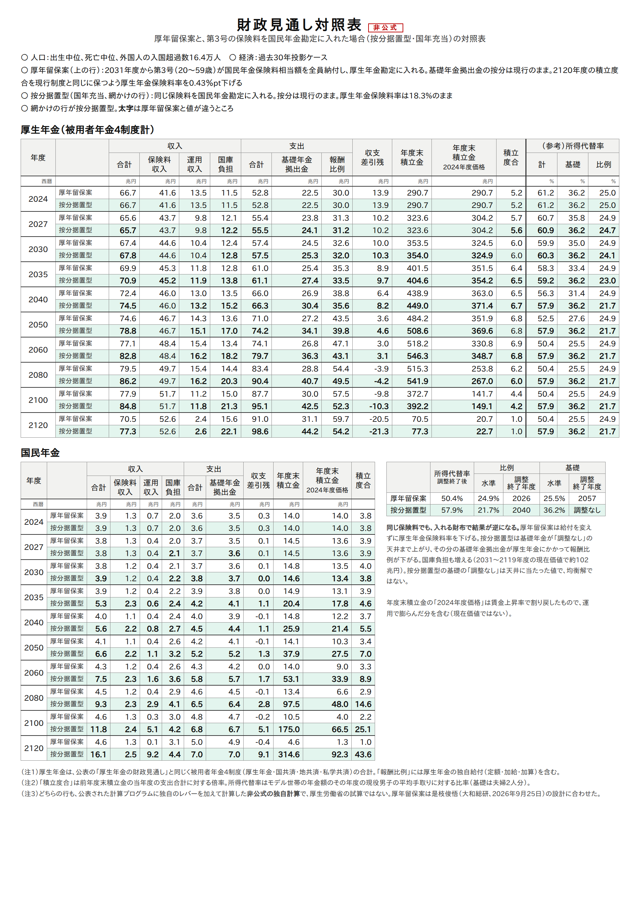
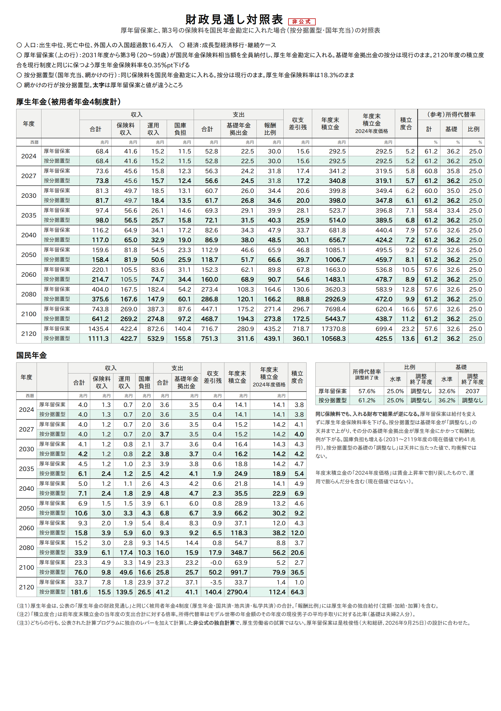

# 第3号の保険料は、どちらの財布に入れるか — 是枝レポートを計算プログラムで確かめる

大和総研の是枝俊悟さんが2026年9月25日に出したレポート
「第3号被保険者制度見直しの財政改善効果は厚生年金保険料率0.1％pt分程度」は、
第3号被保険者に保険料を求めたときの財政影響を、2つの案で試算している。

このレポートの数字を、厚生労働省が公表している2024年財政検証の計算プログラムを動かして確かめた。
そのうえで、レポートが扱っていない3つ目の案（保険料を国民年金に入れ、按分は据え置く）と並べた。

**結論**
1. **レポートの数字は再現できる。** 厚年留保案で下げられる厚生年金保険料率（0.1〜0.4％pt）は、
   8通りすべてで ±0.05％pt 以内に一致した。「国年移行案は基礎年金を下げる」も確かめられた
2. **同じ保険料でも、入れる財布で結果が逆になる。** 厚生年金に入れれば、保険料率が0.4％pt下がるだけ。
   国民年金に入れると、所得代替率は50.4%から57.9%に上がる（過去30年投影）
3. **ただし、国民年金に入れた場合に上がる分の大部分は、第3号の保険料ではない。** 保険料（現在価値28兆円）が
   基礎年金の水準を決める財布の制約を外し、厚生年金の拠出金（+182兆円）と国庫負担（+102兆円）を
   引き出している。問われているのは3号の保険料の大きさではなく、**基礎年金の水準を何で決めるか**である

以下は、厚生労働省の試算ではない**非公式の独自計算**である。

---

## 1. レポートの2つの案と、3つ目の案

第3号の保険料をどう扱うかは、2つの軸で決まる。

- 保険料がどちらの財布（勘定）に入るか
- 第3号の基礎年金の費用（基礎年金拠出金の按分）を、どちらの財布が持つか

| 名前 | 保険料の入り先 | 費用（按分） | レポート |
|---|---|---|---|
| **国年移行案** | 国民年金 | 国民年金 | 扱っている |
| **厚年留保案** | 厚生年金 | 厚生年金のまま | 扱っている |
| **按分据置型（国年充当）** | 国民年金 | 厚生年金のまま | 扱っていない |

## 2. レポートの数字を確かめる

### 厚年留保案：厚生年金保険料率の引き下げ幅（レポートの図表3）

第3号が国民年金保険料相当額（またはその50％）を払い、その保険料を厚生年金に入れる。
そのうえで、2120年度の積立度合が変わらないように厚生年金保険料率を下げる。レポートと同じく、実施は2031年度とした。

| 経済前提 | 加入範囲 | 全額（計算／レポート） | 50％（計算／レポート） |
|---|---|---|---|
| 成長型経済移行・継続 | 現行法のまま | **0.35**／0.32 | **0.17**／0.19 |
| 成長型経済移行・継続 | 週10時間以上 | **0.16**／0.20 | **0.08**／0.10 |
| 過去30年投影 | 現行法のまま | **0.43**／0.40 | **0.21**／0.23 |
| 過去30年投影 | 週10時間以上 | **0.21**／0.26 | **0.11**／0.13 |

8通りすべてで、差は0.05％pt以内に収まる。差が出る主な理由は土台の違いと考えられる（推定）。
レポートは2025年改正を反映した試算を土台にしていて、こちらは2024年財政検証の原本（改正前）である。
詳しくは [検証/3号廃止/厚年留保案.md](../../検証/3号廃止/厚年留保案.md)。

0.43％pt は、2024年度の平均的な男子の標準報酬（月45.5万円）で**月1,937円**（労使計）の軽減になる。

### 国年移行案：基礎年金の水準が下がる

レポートは「国年移行案は国民年金の財政を悪化させ、基礎年金の水準を下げる」としている。
これも計算で確かめられる。2027年度から全員納付とした計算では、次のとおりである。

| 経済前提 | 基礎年金の所得代替率 | 所得代替率 |
|---|---|---|
| 過去30年投影 | 25.5% → **11.2%** | 50.4% → 36.1% |
| 高成長実現 | 31.9% → **24.6%** | 56.9% → 49.5% |

理由はレポートの説明どおりである。国民年金は、1人あたりの基礎年金の費用（拠出金単価の半分）が
保険料より高い。そのため、第1号が増えるほど持ち出しが増える。持ち出しは、計算プログラムの見込みで
2023年度に月2,481円（レポートは実績で2,329円）。

## 3. 厚年留保案と按分据置型（国年充当）を比べる

同じ条件で2つの案を流した（2031年度から、第3号が国民年金保険料相当額を全員納付）。

| | 過去30年投影：厚年留保案 | 過去30年投影：按分据置型 | 成長型：厚年留保案 | 成長型：按分据置型 |
|---|---|---|---|---|
| 所得代替率（調整終了後） | 50.4% | **57.9%** | 57.6% | **61.2%** |
| 　うち基礎 | 25.5% | **36.2%** | 32.6% | **36.2%** |
| 　うち比例 | 24.9% | **21.7%** | 25.0% | 25.0% |
| 基礎の調整終了 | 2057年度 | 調整なし | 2037年度 | 調整なし |
| 比例の調整終了 | 2026年度 | 2040年度 | 調整なし | 調整なし |
| 厚生年金保険料率 | **−0.43％pt** | 18.3%のまま | **−0.35％pt** | 18.3%のまま |
| 国民年金の積立度合（2119年度末） | 1.0 | **43.6** | 1.0 | **64.3** |
| 国庫負担の増（2031〜2119年度・現在価値） | 0 | **+102兆円** | 0 | **+41兆円** |
| 厚生年金の基礎年金拠出金の増（同） | 0 | **+182兆円** | 0 | **+75兆円** |

- 厚年留保案の所得代替率は現行制度と同じである（給付は変えず、保険料率だけ下げる）
- 現在価値は、それぞれのケースの名目運用利回りで2024年度末に割り引いた





### 厚年留保案：給付は変わらず、現役の保険料が少し下がる

第3号の保険料は厚生年金に入り、そのまま厚生年金保険料率の引き下げに回る。
国民年金にも基礎年金にも国庫にも、何の影響もない。レポートのいう「国民年金に中立」である。
財政の効果は小さい。平均的な会社員で月2,000円弱（労使計）である。

### 按分据置型（国年充当）：基礎年金が天井まで上がる

同じ保険料を国民年金に入れると、基礎年金のマクロ経済スライドが要らなくなる。
基礎年金は、スライドをかけない「調整なし」の天井（36.2%）で止まる。

- 基礎年金は1人あたり、2024年度の賃金水準で**月+19,787円**（過去30年投影）になる
- 報酬比例（モデル世帯の夫）は**月−11,638円**になる。上がった基礎年金の費用が、拠出金として厚生年金にかかるためである
- 実施は2031年度からなのに、2027年度の基礎年金はもう36.2%になっている。
  有限均衡は2120年度までを通して判断するので、「最後まで調整が要らない」と決まれば、実施の前からスライドが止まる

## 4. 上がった分は、誰が払っているか

過去30年投影で、2031〜2119年度の現在価値を比べる。

| | 現在価値 |
|---|---|
| 第3号が払う保険料 | **28兆円** |
| 厚生年金が払う基礎年金拠出金の増 | +182兆円 |
| 国庫負担の増 | +102兆円 |
| 国民年金に使われずに残る積立金（2119年度末の積立度合） | 43.6年分 |

28兆円の保険料で、基礎年金の給付が数百兆円増える。増えた分を払っているのは、主に厚生年金（報酬比例の削減）と
国庫（税）である。国民年金には、使い道のない積立金が積み上がる。

これは、今の仕組みが**基礎年金の水準を国民年金の財布だけで決めている**ためである
（[マクロ経済スライド.md](../マクロ経済スライド.md)、[有限均衡.md](../有限均衡.md)）。
国民年金の保険料収入は年1.3兆円ほどしかない。第3号の保険料（年1.1兆円ほど）が入ると、
国民年金の財布は大幅な黒字になり、スライドの必要がなくなる。すると、厚生年金の加入者を含む全員の
基礎年金が上がる。その費用の大半は、按分に従って厚生年金と国庫が自動的に負担する。

基礎年金と報酬比例を1つの財布で均衡させる「調整期間の一致」の下で比べると、3号の保険料そのものの効果は
所得代替率で+1.36％pt ほどになる（過去30年投影、2027年度から実施した計算。
[検証/3号廃止/README.md](../../検証/3号廃止/README.md) §4.4）。按分据置型の+7.5％pt の大部分は、
財布の壁が作り出したものである。

## 5. まとめ

- 是枝レポートの数字は、計算プログラムで再現できる。厚年留保案の効果は保険料率で0.1〜0.4％pt、
  国年移行案は基礎年金の水準を下げる
- 「財政改善効果は限定的」という結論は、厚年留保案で保険料の引き下げに使う場合に当てはまる。
  第3号が払う保険料そのものの大きさは、どの案でも年1兆円強である
- 保険料を国民年金に入れる按分据置型（国年充当）では、基礎年金が天井まで上がる。ただし、その費用の大部分は
  厚生年金と国庫が払い、国民年金には使われない積立金が残る。基礎年金を上げる手段としては、
  3号の保険料よりも「基礎年金の水準を何で決めるか」（調整期間の一致など）のほうが本質的である

第3号の見直しを財政から議論するなら、**保険料をどの財布に入れるか**を最初に決める必要がある。
その選択だけで、基礎年金が下がる（国年移行案）、変わらない（厚年留保案）、天井まで上がる（按分据置型）の
3通りに分かれる。

## 6. 読むときの注意

- **非公式の独自計算である。** 公表された計算プログラムに独自のレバーを加えて計算した。厚生労働省の試算ではない
- **土台は2024年財政検証の原本である。** 2025年改正（適用拡大・標準報酬の上限など）は反映していない
- **全員が納付する前提である。** 第3号の一部を免除すれば、どの案でも効果は小さくなる
- **按分据置型の基礎の「調整なし」は、天井に当たった値である。** 均衡解ではない。国民年金に余った積立金の扱いは、
  別に決める必要がある
- **給付側は変えていない。** 第3号の期間は、どの案でも今と同じく納付済期間として扱っている

## 7. 再現

```sh
python3 検証/3号廃止/ryuho.py run              # 厚年留保案（図表3の8通り）
python3 検証/3号廃止/ryuho.py report
python3 勉強/応用編/第3号の保険料.py run        # 按分据置型（国年充当）を2031年度から
python3 勉強/応用編/第3号の保険料.py report     # 3.の表
python3 勉強/応用編/第3号の保険料.py table      # 対照表（図/）
```

---

*出典：是枝俊悟「第3号被保険者制度見直しの財政改善効果は厚生年金保険料率0.1％pt分程度
—第3号被保険者制度見直しの財政影響を試算—」（大和総研、2026年9月25日）。
計算：厚生労働省「令和6(2024)年財政検証」公表の計算プログラムを、有志のリポジトリでビルド・実行したもの。
現行制度の財政見通しは公表値と全項目一致。3つの案は非公式の独自計算。*
