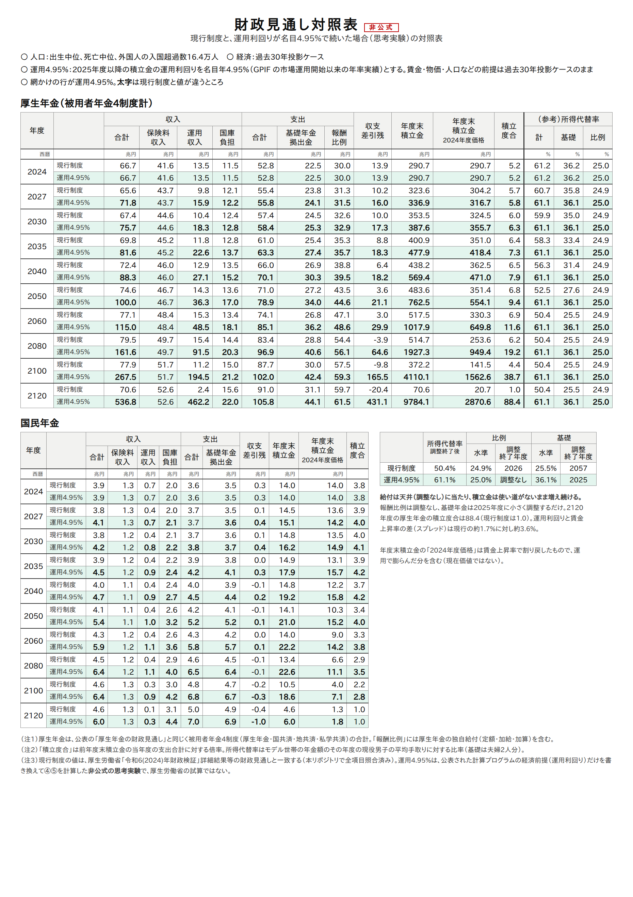
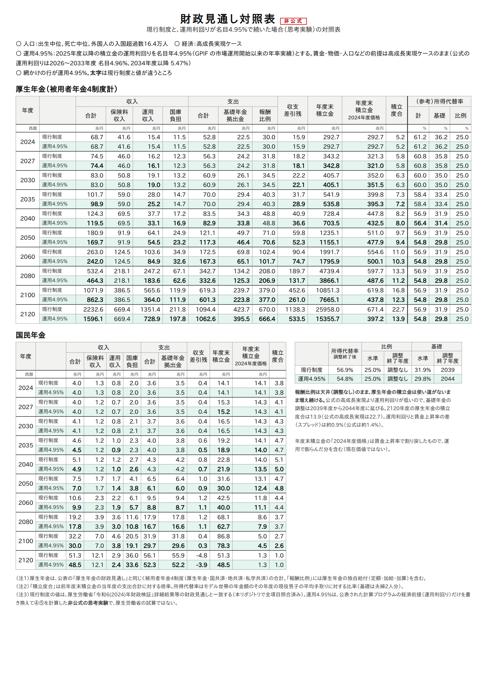

# 運用利回り4.95%が続くなら、「年金保険料は下げられる」は正しい — 財政検証の計算プログラムで確かめた

> 年金は破綻してるって言うと、「年間の収入60兆円、支払60兆円でほぼ均衡。運用残高300兆円、平均運用利回りは年率4.95%。だからむしろ成功してる」って言われるけど、だったらもっと負担下げてほしいと思う現役世代は私だけ？

SNSで見かけたこの問いかけを、厚生労働省が公表している2024年財政検証の計算プログラムを
実際に動かして確かめた。

**結論：運用利回り4.95%が続く世界では、厚生年金の積立金は2120年度までに使い切れずに余る。
余る分を保険料に直すと、ざっくり保険料率1.3〜1.8ポイント分になる（推定）。
「保険料を下げられる」という直感は、この前提の下では数字で裏付けられる。**

ただし「4.95%が続けば」という条件つきである。以下、何をどう計算したかを書く。

---

## 1. 数字の確認

- GPIF の運用資産は **317.8兆円**（2026年6月末）。市場運用を始めた2001年度からの収益率は
  **年率 +4.95%**、累積収益は **+221兆円**
  （[GPIF「2026年度の運用状況」](https://www.gpif.go.jp/operation/the-latest-results.html)）
- 一方、2024年財政検証が長期（2034年度以降）に置いた運用利回りは、
  過去30年投影ケースで**名目3.0%**、高成長実現ケースで**名目5.5%**である
  （計算プログラムの経済前提ファイルから換算）

## 2. 何を計算したか

厚生労働省が公表した財政検証の計算プログラム（C/C++）を、そのまま動かした。
現行制度の結果は、公表された財政見通しと全項目で一致することを確かめてある。

そのうえで、**運用利回りだけを2025年度以降「名目4.95%」に置き換えた**思考実験を2つ流した。
賃金・物価・人口などの前提は、それぞれ公式のケースのまま動かしていない。

| シナリオ | 賃金・物価 | 運用利回り（2034年度以降） | スプレッド（運用−賃金） |
|---|---|---|---|
| A. 過去30年投影（公式） | 名目賃金 1.3% | 3.0% | 1.7% |
| **A'. 過去30年投影の賃金＋運用4.95%** | 名目賃金 1.3% | **4.95%** | **3.6%** |
| B. 高成長実現（公式） | 名目賃金 4.0% | 5.5% | 1.4% |
| **B'. 高成長実現の賃金＋運用4.95%** | 名目賃金 4.0% | **4.95%** | **0.9%** |

年金財政に効くのは運用利回りそのものではなく、**賃金の伸びをどれだけ上回るか（スプレッド）**
である。A' は公式のどのケースよりも有利、B' は公式の高成長実現よりも不利な世界になる。

## 3. 結果：厚生年金の積立金は使い切れずに余る

| | 所得代替率 | 報酬比例の調整 | 基礎年金の調整 | 厚生年金の積立度合（2120年度） | 使い切れない積立金（現在価値） | 保険料率に換算（推定） |
|---|---|---|---|---|---|---|
| A. 過去30年投影（公式） | 50.4% | 2026年度まで | 2057年度まで | **1.0** | ほぼ0 | — |
| **A'. ＋運用4.95%** | 61.1% | 調整なし | 2025年度まで | **88.4** | **約94兆円** | **約1.8ポイント** |
| B. 高成長実現（公式） | 56.9% | 調整なし | 2039年度まで | **22.7** | 約157兆円 | 約1.7ポイント |
| **B'. ＋運用4.95%** | 54.8% | 調整なし | 2044年度まで | **13.9** | **約138兆円** | **約1.3ポイント** |

- **積立度合**は、その年度の支出の何年分の積立金を持っているか。財政検証のルールでは、
  2120年度にちょうど「1」（1年分）になるように給付水準を決める
- **使い切れない積立金**は、2120年度に残る積立金から、ルールで残すべき1年分を引き、
  それぞれの運用利回りで2024年度末に割り引いた値
- **保険料率に換算**は、その額を2025〜2120年度の厚生年金の標準報酬の総額（同じく現在価値）で
  割ったもの。保険料を毎年同じだけ下げた場合の目安で、保険料を下げて計算し直したものではない

A' でも B' でも、厚生年金の積立度合は2120年度に1を大きく超え、**積立金が使われないまま残る**。
現在の保険料率18.3%に対して、1.3〜1.8ポイント分（16.5〜17.0%程度）である。

注目したいのは、**公式の高成長実現ケース（B）でも同じことが起きている**ことだ。
報酬比例は「調整なし」のまま、2120年度の積立度合は22.7、保険料率で約1.7ポイント分が余る。

財政見通しの全体は、次の対照表にある（どちらも非公式の思考実験。PDF は [過去30年投影](図/対照表_3003_運用495.pdf)・[高成長実現](図/対照表_3001_運用495.pdf)）。





## 4. なぜ余るのか：今のルールは「下げる方向」にしか動かない

（仕組みは [有限均衡.md](../有限均衡.md)・[マクロ経済スライド.md](../マクロ経済スライド.md)・[所得代替率.md](../所得代替率.md) にコードつきで書いた）

2004年改正で決まった今の仕組みは、

- **保険料は上限（厚生年金18.3%）で固定**
- **給付はマクロ経済スライドで下げる**。下げなくてよい場合も「調整なし」で止まり、それより上には上げない

というものだ。経済が悪ければ給付を下げて帳尻を合わせるが、**経済が良くて積立金が余っても、
保険料を下げる・給付を上げるといった「返す」仕組みがない**。報酬比例が「調整なし」に張りつくと、
余った分はそのまま積立金に積み上がっていく。

A' で厚生年金の積立度合が88まで膨らむのも、公式の B で22.7になるのも、同じ理由である。

## 5. ただし：この結論が成り立つ条件

**(1) 4.95%は「これまでの平均」であって、これからの約束ではない。**
公式の過去30年投影（運用3.0%）では、積立金は2120年度にちょうど使い切られ、余りはない。
この世界で保険料を下げれば、そのぶん将来の給付をもっと削ることになる。
「下げられる」は、運用が賃金を大きく上回り続けるという前提の上の話である。

**(2) 余っているのは厚生年金で、国民年金ではない。**
どのシナリオでも国民年金の積立度合は2120年度に1.0で、余りはない。B' では基礎年金の水準は
公式の高成長実現より下がる（31.9% → 29.8%）。厚生年金の余りの使い道は、保険料の引き下げだけでなく、
基礎年金の底上げ（基礎年金と報酬比例の調整期間を一致させる案など）とも取り合いになる。

**(3) 保険料率への換算は推定である。**
使い切れない積立金を、保険料を毎年同じだけ下げたと仮定して割り算した目安で、
保険料率を実際に下げて計算し直したものではない。

**(4) 非公式の計算である。**
公式の計算プログラムの運用利回りだけを置き換えた思考実験で、厚生労働省の試算ではない。

## 6. まとめ

「運用がうまくいっているなら、現役の負担を下げてほしい」という感覚は、今の年金財政の
ルールと矛盾するように見える。今の積立金は、将来の高齢化のピークに備えて計画的に
貯めているものだからだ。

しかし、運用利回りが賃金の伸びを大きく上回り続ける世界では、その「計画」を超えて積立金が余る。
今のルールはその余りを返す手段を持っていない。元ツイの直感は、**運用が今の調子で続く限り、
数字で裏付けられる**。

問うべきは「今すぐ下げるか」ではなく、**上振れしたときに、保険料を下げたり給付を上げたりする
逆向きのルールを作るかどうか**だろう。

## 再現

```bash
# 前提：通常試算（予備番号 000）が流してあること
検証/実行/run_pipeline.sh 3003 1 1 0 2
検証/実行/run_pipeline.sh 3001

python3 勉強/応用編/運用利回り.py run 3003 0.0495   # 過去30年投影の賃金・物価で運用4.95%
python3 勉強/応用編/運用利回り.py run 3001 0.0495   # 高成長実現の賃金・物価で運用4.95%
python3 勉強/応用編/運用利回り.py report            # 3節の表
python3 勉強/応用編/運用利回り.py table 3003 3001   # 対照表（図/）
```

[運用利回り.py](運用利回り.py) は、経済前提の運用利回りと、②の出力に記録された利回りの欄を
一時的に書き換えて④⑤を流し、終わったら元に戻す（md5 で確認する）。②は利回りを出力に
書くだけで計算には使っていないので、②を流し直したのと同じになる。

---

*計算：厚生労働省「令和6(2024)年財政検証」公表の計算プログラムを、有志のリポジトリで
ビルド・実行したもの。現行制度の財政見通しは公表値と全項目一致。運用利回り4.95%のシナリオは
非公式の思考実験。GPIF の実績は GPIF の公表資料による。*
