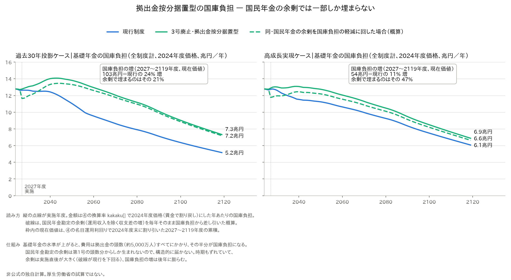
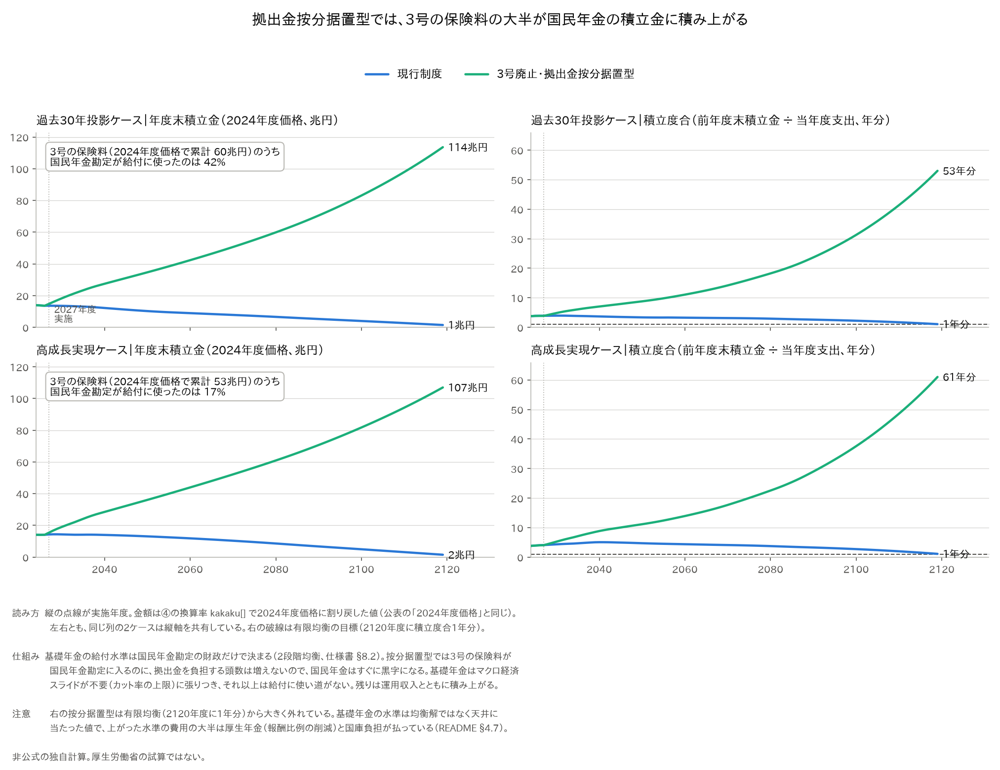
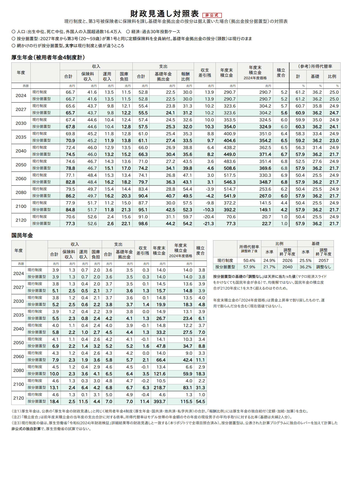
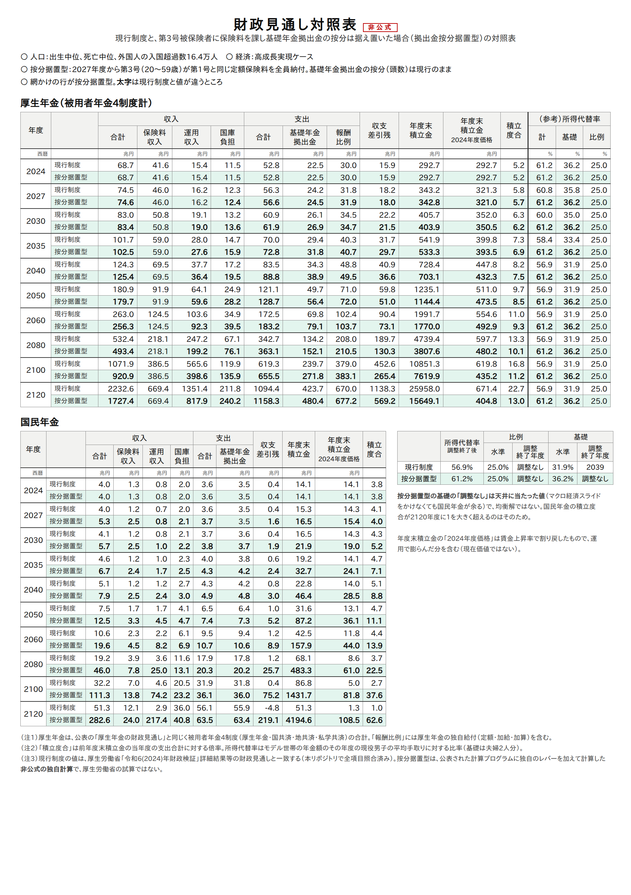
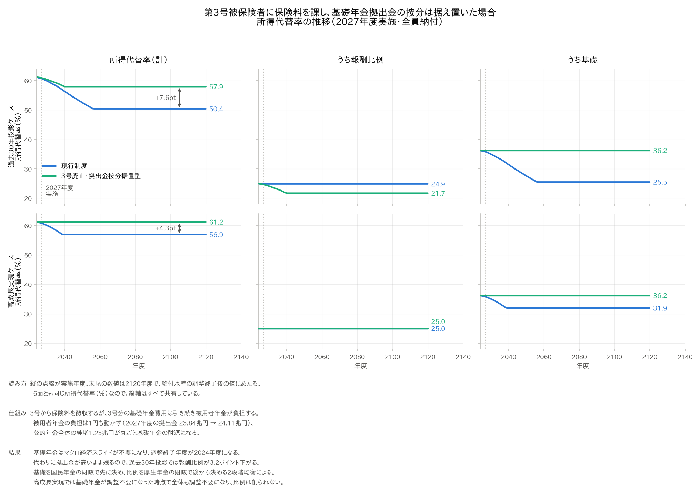
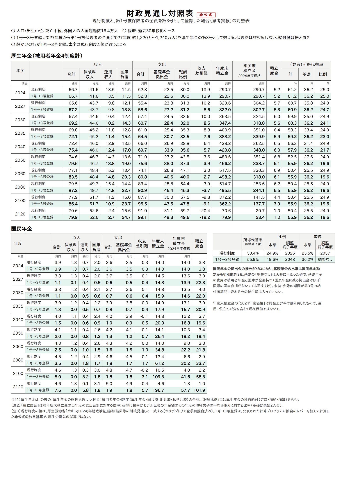

# 第3号被保険者に保険料を求めたら年金に何が起こるか — 財政検証プログラムで計算する

> **これは厚生労働省の試算ではありません。** 公表された2024年財政検証プログラムに、
> 原本にないレバー（号別被保険者の廃止）を約70行のパッチで足して、このリポジトリが
> 独自に計算したものです。①〜③（人口・被保険者・厚生年金給付・国民年金給付）は
> 通常試算のまま据え置き、④基礎年金の頭割りと⑤収支計算だけを流し直しています。
> 数表は `結果.md`（`analyze_sango.py` が出力ファイルから機械的に拾ったもの）。

## 1. 問い

第3号被保険者（被用者の被扶養配偶者、約650万人）を廃止して第1号被保険者にし、
**全員が国民年金の保険料を納める**としたら、

1. 国民年金勘定の収支と積立金はどう動くか
2. 基礎年金の給付水準（マクロ経済スライドの調整終了年度）はどう動くか
3. 厚生年金勘定と報酬比例部分はどう動くか
4. 公的年金全体の総収入は増えるのに、受給者の年金は増えるのか

事前の予想は「国民年金の積立金フローが悪化して基礎年金水準が下がる。公的年金全体の
総収入は増えるが、報酬比例のマクロ経済スライド調整はほぼ終わっているので、みなの
年金給付は増えない」だった。結果はこの予想を支持し、過去30年投影ケースでは
予想より強い結果（国民年金が均衡期間内に均衡できない）になった。

ただし計算を進めると、**この結果は政策そのものではなく、基礎年金の水準を国民年金
勘定だけで決める均衡ルール（勘定の壁）と、基礎年金拠出金の按分の扱いで決まっている**
ことが分かった。同じ「3号が保険料を払う」でも、按分から3号を外すか据え置くかで
所得代替率が 36.12% と 57.94% に分かれる（§4.7）。どちらも勘定の壁が作った極端な値で、
**壁を外して比べると、3号の保険料そのものの効果は +1.36pt（過去30年投影）**になる（§4.4）。
そこで2つの財政構造を並べ、調整期間の一致（壁なし）とも比べた。

| 呼び名 | 内容 | レバー |
|---|---|---|
| **第1号移行型** | 第3号を第1号にし、拠出金の按分の頭数も国民年金へ移す | `SANGO_MODE=0`（既定） |
| **拠出金按分据置型** | 第3号から保険料を徴収するが、3号分の基礎年金費用は引き続き被用者年金が負担する | `SANGO_MODE=1` |

## 2. 3号はモデルのどこに効いているか

仕様書 §6.2 のとおり、基礎年金の費用は各制度の**拠出金算定対象被保険者数**（20〜59歳）
で頭割りされる。第3号は本人が保険料を払わないが、**配偶者の加入する被用者年金制度の
頭数に数えられる**（`基礎年金/waku.c` が `SanteiTaishou[制度][年度][3号]` に積む）。
つまり会計上、3号1人分の基礎年金費用は厚生年金（と共済）の拠出金が負担している。

国民年金の保険料収入は、④が `保険料月額 × 国年の算定対象者（1号、納付・免除加重）× 12`
で計算する（`read_file.c:160-166`）。

したがって「3号を1号にして保険料を払わせる」は、モデル上は

```
実施年度以降の各年度 k について
  振替[k]                        = Σ_{被用者4制度} SanteiTaishou[制度][k][3号]
  SanteiTaishou[制度][k][3号]    ← 0
  SanteiTaishou[国年][k][1号]    += 振替[k] × 納付率
```

という**頭数の移動1つ**で表現できる。移動した頭数は、拠出金の頭割り（国年の負担増・
被用者年金の負担減）と国民年金の保険料収入（増）に同時に効く。

給付側は触らない。第3号期間はもともと納付率1（全額納付期間）として給付に反映されて
いる（`国民年金/noufuritu.c: noufuritu_3gou_cal()`）ので、「全員納付」の前提では
給付は変わらない。

`SANGO_MODE=1`（拠出金按分据置型）では `SanteiTaishou` を書き換えず、
保険料だけを徴収する人数として別に持つ。④の保険料収入の式
（`read_file.c:160-166`）に加わるだけなので、**保険料が増えて拠出金の按分は
動かない**。被用者年金の負担は1円も変わらない。

### 実装

- `検証/実行/patches/sango-haishi.patch` — ④の `waku.c`・`read_file.c`・`mkisosu.h`
  に上の処理を追加（環境変数 `SANGO_HAISHI`＝実施年度、`SANGO_NOUFU`＝納付率、
  `SANGO_MODE`＝財政構造）
- `検証/実行/run_pipeline.sh` — レバー `SANGO`（実施年度、0=なし）・`SANGO_NOUFU`
  （既定1）・`SANGO_MODE`（既定0）。レバーを立てたときだけパッチを当ててビルドし、
  ④が「効いた証拠の1行」を出さなければ止める
- `run_sango.sh` — ベース・3号廃止・調整期間の一致の組合せを予備番号を変えて流す
- `analyze_sango.py` — ④ `kekka*a.csv`・⑤ `03summary` から比較表と図を作る

通常試算（`SANGO=0`）ではパッチを当てないので、公表値との照合結果
（41,904項目・不一致0）は一切変わらない。パッチを当てたビルドに環境変数を渡さずに
通常試算を流しても、④の出力は通常試算とバイト一致する（実測で確認）。

> **同じパッチに第2号を動かす口（`NIGO`）もある。** 被用者年金の拠出金算定対象者を
> 0 にする、つまり基礎年金拠出金制度そのものを廃止した場合の計算に使うもので、
> **この文書の対象ではない**。レバーの仕様は仕様書 §11.3 にある。


## 3. 設定

| 項目 | 値 |
|---|---|
| 実施年度 | 2027年度（適用拡大の実施年度と同じ。以降の全年度に適用） |
| 対象 | 被用者年金4制度の第3号（20〜59歳、年央値）＝2027年度 617万人 → 2060年度 348万人 → 2100年度 218万人 |
| 振替後の扱い | 国民年金の納付者（重み1）。保険料は第1号と同じ月17,000円（2004年度価格）×改定率 |
| 経済前提 | 過去30年投影ケース（3003、労働参加漸進）・高成長実現ケース（3001） |
| 給付水準の決め方 | 現行（基礎を国年で先に均衡、比例を厚年で後から）と、調整期間の一致（TOUGOU=1） |
| 感度 | 振替後の納付率 0.8（頭数と保険料だけ落とす。給付側の減額は入れていない） |

## 4. 結果

> **読む前に。** ここで動かしているのは第3号の保険料負担だけで、**定額保険料の
> 水準・厚生年金保険料率・基礎年金の均衡ルール（勘定の壁）の3つは現行のまま
> 固定**している。この3つが結果をかなりの程度決めている。
>
> | 固定したもの | 値 | 何を強制しているか |
> |---|---|---|
> | 定額保険料 | 月17,587円（2027年度・実効） | 基礎年金の1人当たり実負担 21,037円 を下回る。頭数を移すほど国民年金の赤字が増えるのは算術 |
> | 厚生年金保険料率 | 18.3%（据え置き） | 被用者年金に浮いた分が戻らず、積立金に積まれる |
> | 勘定の壁 | 基礎の水準は国民年金勘定だけで決まる | 損は全受給者へ、得は厚生年金の積立金へ、という非対称が自動的に出る |
>
> 特に1つ目が効く。月17,000円（2004年度価格）は第1号が約600万人であることを
> 前提に決まった水準で、最初から1人当たり赤字であり、それを積立金の運用収入と
> マクロ経済スライドで埋めている。第1号移行型で頭数を約2倍にすれば赤字も倍になる。
>
> **3つ目（勘定の壁）が結果の大部分を決めている。** 第1号移行型は壁の片側（国民年金）に
> 損を、拠出金按分据置型は同じ側に得を寄せる設計で、どちらも極端な値になる。壁を外す
> のが §4.4 の調整期間の一致で、そこで比べた差（+1.36pt）が3号の保険料そのものの効果である。
> **この文書の主結果はそこにある。**

### 4.1 所得代替率（給付水準の調整終了後）

| ケース | シナリオ | 所得代替率 | うち比例 | うち基礎 | 調整終了（基礎） | 国年 2120年度初の積立度合 |
|---|---|---|---|---|---|---|
| 過去30年投影 | 現行制度 | **50.39%** | 24.88% | 25.52% | 2057年度 | 1.00 |
| 過去30年投影 | 第1号移行型 | **36.12%** | 24.97% | 11.15% | **2120年度（均衡せず、下の天井）** | −10.84（2054年度に負） |
| 過去30年投影 | 拠出金按分据置型 | **57.94%** | 21.73% | 36.21% | **2024年度（調整不要、上の天井）** | **54.49** |
| 過去30年投影 | 現行＋調整期間の一致 | **56.16%** | 22.92% | 33.24% | 2036年度 | —（一体で均衡） |
| 過去30年投影 | 第1号移行型＋一致 | **57.52%** | 23.48% | 34.04% | 2033年度 | —（一体で均衡） |
| 過去30年投影 | 拠出金按分据置型＋一致 | **57.52%** | 23.48% | 34.04% | 2033年度 | —（一体で均衡） |
| 高成長実現 | 現行制度 | **56.91%** | 24.97% | 31.94% | 2039年度 | 1.00 |
| 高成長実現 | 第1号移行型 | **49.53%** | 24.97% | 24.55% | 2058年度 | 1.00 |
| 高成長実現 | 拠出金按分据置型 | **61.18%** | 24.97% | 36.21% | 2024年度（上の天井） | **62.57** |
| 高成長実現 | 現行＋一致／第1号移行型＋一致／按分据置型＋一致 | **61.18%** | 24.97% | 36.21% | 2024年度（調整不要） | —（一体で均衡） |

現行制度の4行（50.39／56.16／56.91／61.18）は公表値と一致する（仕様書 §15.0.0・§15.9。
過去30年投影＋一致の 56.16% は詳細結果等2 No.23 と照合し 2,134項目・不一致0）。

**天井に当たった値は均衡解ではない。** 第1号移行型（過去30年投影）はマクロ経済スライドを
2120年度まで続けても国民年金が均衡しない下の天井、拠出金按分据置型はスライドを
まったくかけなくても国民年金が余る上の天井で、2120年度の積立度合が目標の1に対して
54〜63年分になる。どちらの水準も「そこで止まった」値であって、財政が釣り合った値ではない。

### 4.2 なぜ悪化するのか — 1人当たりの収支

**第1号の保険料が、基礎年金の1人当たり実負担（拠出金単価 − 国庫負担単価）を
下回っている。** 2027年度で保険料 約17,600円／月 に対し実負担 約21,000円／月、
2040年度には差が約 7,900円／月 に開く（保険料は賃金で改定されるが、拠出金単価は
受給者／被保険者比率の悪化を丸ごと受けるため）。

現行制度の第1号約600万人でも同じギャップがあるが、そちらは国民年金積立金
（約14兆円）の運用収入と基礎年金のマクロ経済スライドで埋めている。
**移す頭数を増やすほど、運用収入は増えないのに1人当たり赤字が積み上がる。**
第3号を移すと頭数はおよそ2倍になる。

### 4.3 厚生年金は巨額の黒字になるが、受給者の年金は増えない

被用者年金側は拠出金負担が消える。過去30年投影の厚生年金勘定（4制度計）の
積立金は、現行制度との差で

| 年度 | 積立金の差（第1号移行型 − 現行） |
|---|---|
| 2050 | +46兆円（支出の0.9年分） |
| 2100 | +595兆円（9.0年分） |

報酬比例のマクロ経済スライドは過去30年投影で2026年度、高成長実現では最初から
調整不要なので、**財政が良くなっても給付を上げる仕組みが現行法にない**。
積立金として貯まるだけである。

### 4.4 勘定の壁を外すと — 3号の保険料そのものの効果は +1.36pt

調整期間の一致は、国民年金と厚生年金を一体で均衡させる（勘定の壁を外す）。
このとき**第1号移行型と拠出金按分据置型は15桁まで同じ答えになる**
（57.5205383403752%、一元化の積立金の差は最大1e-11兆円）。一体で均衡させるなら、
拠出金の按分は勘定の間の移転にすぎないからである。

| ケース | 現行＋一致 | 3号廃止＋一致（按分の置き方によらない） | 差 |
|---|---|---|---|
| 過去30年投影 | 56.16% | 57.52% | **+1.36pt** |
| 高成長実現 | 61.18% | 61.18% | ±0 |

**+1.36pt が、公的年金全体の純増（年1.23兆円）が買える給付水準である。** 高成長実現は
現行＋一致の時点で既に調整不要（上限）なので、純増は積立金に貯まるだけになる。

按分据置型の +7.55pt（§4.7）と比べると、その内訳はこうなる。

| 過去30年投影 | 所得代替率 | 差 | 何の効果か |
|---|---|---|---|
| 現行制度 | 50.39% | | |
| 現行＋一致 | 56.16% | +5.77pt | **勘定の壁を外す効果**。3号の政策とは無関係で、新しい財源もない |
| 3号廃止＋一致 | 57.52% | +1.36pt | **3号の保険料の効果** |
| 拠出金按分据置型 | 57.94% | +0.42pt | 上の天井に当たったことによる歪み |

つまり按分据置型の改善の大半は「3号に保険料を課したから」ではなく、「基礎年金の
水準を国民年金勘定だけで決めるルールが、保険料の流入で逆向きに振れたから」である。

### 4.5 国庫負担 — 振替では動かず、給付水準が動くと動く

国庫負担は基礎年金給付費の1/2を頭数で按分したもの。振替は分子（基礎年金の総額）を
動かさないので、**総額は配分が変わるだけで直接には1円も動かない**。

| 過去30年投影・2027年度 | 国庫負担 合計 | 国年分の差 | 被用者年金分の差 |
|---|---|---|---|
| 第1号移行型 | 13.44兆円（±0） | +1.56兆円 | −1.56兆円 |

総額が動くのは基礎年金の給付水準そのものが変わったときである（`結果.md` 表5）。

| 過去30年投影、現行との差（兆円・名目） | 2040 | 2060 | 2100 |
|---|---|---|---|
| 第1号移行型 | ±0.00 | −0.48 | **−6.60** |
| 拠出金按分据置型 | +1.93 | +5.35 | **+7.02** |

第1号移行型の減少は**国庫が得をしたのではなく、給付が削られた分の半分**である。
逆に按分据置型では基礎年金が上がるぶん、**国庫負担が2100年度で年7兆円増える**。
按分据置型は「追加の財源なしで給付が上がる」設計ではない。ただしこれは按分据置型に
特有の費用ではなく、基礎年金を上げればどの設計でも付いてくる（§4.7）。

### 4.6 感度 — 納付率 0.8

振替者の2割が未納（頭数にも保険料にも乗らない）としても、過去30年投影は 36.12% で
変わらず、積立金が負になる年度が2054→2055年度に1年ずれるだけ。均衡できない領域では
納付率の差は水準に現れない。高成長実現では 49.53% → 49.49%。給付側の減額
（未納期間分の基礎年金の減）は入れていないので、頭数効果の下限の目安である。

### 4.7 同じ「3号が保険料を払う」でも、拠出金の按分で符号が変わる

ここまでの計算は、第3号を第1号へ移すときに**拠出金の按分の頭数も一緒に移して**
いた（第1号移行型）。これは号の付け替えとしては自然だが、財政上は増収の
行き先を決めてしまう。按分を現行のまま据え置く設計と並べると、同じ政策が
逆向きの結果になる。

| 呼び名 | 内容 | レバー |
|---|---|---|
| **第1号移行型** | 第3号を第1号にし、拠出金の按分の頭数も国民年金へ移す | `SANGO_MODE=0`（既定） |
| **拠出金按分据置型** | 第3号から保険料を徴収するが、3号分の基礎年金費用は引き続き被用者年金が負担する | `SANGO_MODE=1` |

### 3.1兆円の分解 — グロスとネットを分ける

第1号移行型で被用者年金に生まれる「黒字」はよく3.1兆円と言われるが、これは
グロスの数字である。

```
617万人 × 42,074円/月 × 12か月 = 3.11兆円
（3号の拠出金算定対象者）（基礎年金拠出金の単価）
```

基礎年金拠出金は**その半分を国庫が負担**する。被用者年金勘定では拠出金が支出、
国庫負担が収入として両建てで立っているので、拠出金が消えれば国庫負担の収入も消える。

| 厚生年金勘定（2027年度、第1号移行型 − 現行、兆円） | |
|---|---|
| 基礎年金拠出金（支出） | −3.11 |
| 国庫負担 うち基礎（収入） | −1.56 |
| 支出計 | −3.01 |
| 収入計 | −1.54 |
| **収支差** | **+1.47** |

**正味の改善は1.47兆円**で、総報酬242兆円の0.61ポイント、保険料率でいえば
18.3%が17.7%相当になる程度である。

### その1.47兆円の出どころ

拠出金の経路だけで見ると、厚生年金勘定の改善は 3.11 − 1.56 = **1.56兆円**。
そこから報酬比例の給付増（過去30年投影では2026年度の比例の調整が要らなくなり、
比例が 24.88% → 24.97% に上がる）を払って、収支差の改善が1.47兆円になる。

| 誰が | 年額（兆円、2027年度） |
|---|---|
| 元3号が新たに払う定額保険料 | −1.23 |
| 国民年金勘定の正味の悪化 | −0.33 |
| **厚生年金勘定に入る分**（拠出金の減 − 国庫負担の減） | **+1.56** |
| 　うち報酬比例の給付増に回る | −0.10 |
| 　うち厚生年金勘定の収支差の改善 | +1.47 |
| 国庫 | ±0（配分が変わるだけ） |

（−1.23 − 0.33 + 1.56 = 0。運用収入の差 +0.02 は省いた）

**公的年金全体の純増は1.23兆円だけ**で、それが元3号本人の新規負担にあたる。
残りの0.33兆円は国民年金勘定から厚生年金勘定への移転で、基礎年金の給付水準低下
という形で全受給者が負担する。国庫負担は総額が1円も動かない（§4.5）。

第1号移行型の問題は、**公的年金全体の唯一の純増1.23兆円が、基礎年金ではなく
被用者年金の積立金へ流れてしまう**ことにある。報酬比例の調整はほぼ終わっている
ので、そこに積まれた分は誰の給付にもならない（§4.3）。

### 拠出金按分据置型 — 純増を国民年金勘定に入れる

按分を据え置けば、実施年度には被用者年金の負担はほとんど動かず（2027年度の拠出金は
23.84兆円→24.11兆円）、純増1.23兆円は国民年金勘定に入る。国民年金勘定の保険料収入は
1.27兆円から2.49兆円へほぼ倍増する。**ただし、それで基礎年金の水準が上がると、その
費用は国民年金勘定だけでは払われない**（下の「上がった基礎年金は誰が払うか」）。

| 過去30年投影ケース | 所得代替率 | うち比例 | うち基礎 | 調整終了（比例） | 調整終了（基礎） |
|---|---|---|---|---|---|
| 現行制度 | 50.39% | 24.88% | 25.52% | 2026年度 | 2057年度 |
| 第1号移行型 | **36.12%** | 24.97% | 11.15% | 2024年度 | 2120年度（均衡せず） |
| **拠出金按分据置型** | **57.94%** | 21.73% | **36.21%** | 2040年度 | **2024年度（調整不要）** |

| 高成長実現ケース | 所得代替率 | うち比例 | うち基礎 |
|---|---|---|---|
| 現行制度 | 56.91% | 24.97% | 31.94% |
| 第1号移行型 | 49.53% | 24.97% | 24.55% |
| **拠出金按分据置型** | **61.18%** | 24.97% | **36.21%** |

**基礎年金はマクロ経済スライドが不要になる。** 調整終了年度が2024年度、つまり
今後の給付水準の削減がゼロで、基礎年金の所得代替率は25.52%から36.21%へ
10.7ポイント上がる。**ただしこれは上の天井（最終カット率 0.9900）に当たった値で、
均衡解ではない**（§4.1）。国民年金は水準を上げきってもなお余る。

**代わりに報酬比例が下がる。** 過去30年投影で24.88%から21.73%へ3.15ポイント
低下し、調整終了が2026年度から2040年度に延びる。基礎年金の水準が高いままだと
拠出金も高いままなので、厚生年金がその分を吸収する。財政検証の2段階均衡
（基礎を国民年金の財政で先に決め、比例を厚生年金の財政で後から決める。§8.2）が
そのまま出ている。高成長実現ケースでは基礎年金が調整不要になった時点で全体も
調整不要になり、今日の61.18%で止まって比例は削られない。

### 上がった基礎年金は誰が払うか

基礎年金の水準は全員に共通なので、上がった費用は拠出金の頭数に比例して全制度に
かかる。国民年金勘定（1号）が払うのはその一部で、大半は厚生年金と国庫が払う
（`結果.md` 表2-3003-501・表5。過去30年投影、現行との差、兆円・名目）。

| 年度 | 3号の新しい保険料 | 厚生年金の拠出金の増 | 国庫負担の増 |
|---|---|---|---|
| 2040 | +1.04 | +3.45 | +1.93 |
| 2060 | +1.11 | +9.57 | +5.35 |
| 2100 | +1.17 | **+12.56** | **+7.02** |

厚生年金はその分を報酬比例の削減（−3.15pt）で吸収する。国庫負担は一般財源である。
**「追加の財源なしで給付が上がる」のではなく、財源の大半は国庫と厚生年金の加入者が
出している。**



#### 国庫負担の増は、基礎年金を上げる目的の値段である

国庫負担は法定で基礎年金の1/2なので、**基礎年金を上げれば、上げた分の半分が必ず国庫に
来る**。按分据置型に特有の費用ではない。基礎年金を上げる設計どうしで比べると、どれも
「国庫負担の増 ÷ 基礎年金の費用の増」がちょうど 0.50 になる（2027〜2119年度の累積、
④の名目運用利回りで2024年度末に割り引いた現在価値、兆円）。

| ケース | 設計 | 基礎（2120年度） | 基礎年金の費用の増 | 国庫負担の増（現行比） | 比 |
|---|---|---|---|---|---|
| 過去30年投影 | 現行＋調整期間の一致（厚労省のオプション試算） | 33.24% | 127.3 | 63.6（+15%） | 0.50 |
| 過去30年投影 | 3号廃止＋調整期間の一致 | 34.04% | 146.3 | 73.2（+17%） | 0.50 |
| 過去30年投影 | 拠出金按分据置型 | 36.21% | 205.4 | 102.7（+24%） | 0.50 |
| 高成長実現 | 現行＋一致／3号廃止＋一致／按分据置型 | 36.21% | 107.2 | 53.6（+11%） | 0.50 |

- **高成長実現では、按分据置型の国庫負担の増は、厚労省自身が示した調整期間の一致と
  まったく同額**である。どちらも基礎年金を天井（36.21%）まで上げるからである
- 過去30年投影で調整期間の一致より39兆円多いのは、その分だけ基礎年金を高く
  （33.24% → 36.21%）しているからである
- 年あたりでは、過去30年投影の2060年度以降に現行の約4割増（2024年度価格で年2〜3兆円）が
  続く。この値段を払う価値があるかは、基礎年金の水準をどこまで上げたいかという
  価値判断になる

国民年金勘定の余剰（運用収入を除く収支差の増）を毎年国庫負担の軽減に回すと
（図の破線、概算）、実施直後の十年ほどは国庫負担が現行を下回るが、累積の現在価値で
埋まるのは**国庫負担の増の21%（21.8兆円）、47%（25.4兆円）**にとどまる。
余剰は第1号の頭数分からしか生まれないので、構造的に届かない。

`python3 検証/3号廃止/make_kokko_chart.py` で作り直せる（上の比較表も出力する）。

### 3号の保険料は国民年金の積立金に積み上がる

一方で、3号が払った保険料は多くが使われない。国民年金勘定は基礎年金の水準を上げきっても
余り、残りは積立金に積み上がる。



| | 過去30年投影 | 高成長実現 |
|---|---|---|
| 3号の保険料（2027〜2119年度、2024年度末の現在価値） | 32.5兆円 | 30.0兆円 |
| 積み上がった分（2119年度、現行との差、同） | **22.1兆円（保険料の68%）** | **26.0兆円（同87%）** |
| 積立度合（2119年度） | 現行 1.1年分 → **53年分** | 現行 1.1年分 → **61年分** |

**金額は現在価値で見る。** 積立金は運用利回りで増えるので、2024年度価格（賃金で割り戻す。
公表の慣行）で見ると運用で膨らんだ分まで含んで、2119年度の差が約112兆円・106兆円に見える。
名目運用利回りで割り引くと運用で膨らんだ分が消え、積み上がった保険料の正味だけが残る。
現在価値の線は2040年代以降ほぼ横ばいで、積み上がったのは実施直後の十数年の保険料である。

**額は大きくないが、割合は大きい。** 積み上がるのは現在価値で22〜26兆円を90年かけて、
であり、しかもお金は消えずに国民年金の積立金に残るので、あとから保険料を下げるなどして
使える。財政上の損失ではない。一方で、3号の保険料の現在価値の7〜9割が給付に使われて
いない（賃金で割り戻した2024年度価格で累計すると、給付に使ったのは42%・17%。重みの
付け方が違うので割合も違う）。有限均衡方式は2120年度に積立度合1を目標にするので、
53〜61年分は目標から大きく外れている。

これは財政の問題というより、**「取るだけ取って使わない保険料」という見え方の問題**で
ある。制度として示すなら、余剰が出た段階で第1号の保険料を引き下げるなどの手当てを
あわせて置くのがよい（**余剰の行き先の設計**。§6「次にやること」）。

`python3 検証/3号廃止/make_tumitate_chart.py` で作り直せる。

### 財政見通し対照表

厚生労働省の「財政見通し」と同じ形の表で、現行制度と按分据置型を並べた
（法改正の「新旧対照表」に倣って**財政見通し対照表**と呼ぶ）。各年度2行で、
上が現行制度、網かけが按分据置型。**太字は現行制度と値が違うところ**。
現行制度の行は公表の財政見通しと一致する。

**過去30年投影ケース**（[PDF](図/対照表_3003_501_按分据置.pdf)）



読みどころ：

- 厚生年金は、基礎年金拠出金が増え（2120年度 31.1 → 44.2兆円）、報酬比例が減る
  （同 59.7 → 54.2兆円、比例の所得代替率 24.9% → 21.7%）。積立金の道筋はほぼ変わらない
- 国民年金は、保険料収入が約2倍（2027年度 1.3 → 2.5兆円）になり、収支差引残がずっと
  プラス。積立度合は2120年度に 1.0 → 54.5
- 国庫負担は、厚生年金側・国民年金側とも按分据置型のほうが大きい

**高成長実現ケース**（[PDF](図/対照表_3001_501_按分据置.pdf)）



高成長実現では報酬比例が削られない（25.0%のまま）ので、厚生年金は拠出金が増えた分
だけ積立金が減る（2120年度 25,958 → 15,649兆円、名目）。

ファイル名は `対照表_{試算番号}_{予備番号}_{短い名前}`。試算番号と予備番号
（`run_sango.sh` の一覧）の組で一意に決まる。
`python3 検証/3号廃止/make_taishohyo.py` で作り直せる（ヘッドレス Chromium が要る）。
新しいシナリオは、スクリプトの `SCENARIOS` 台帳に1項目足して
`--case 3003 --yobi <予備番号>` で出す。

### 図



現行制度と拠出金按分据置型の2本だけを、経済前提2ケース × 内訳3種で並べた図。
注釈は図の中に入れてある。

図の作りで決めたこと。

- **6面すべてで縦軸を共有した。** どれも同じ所得代替率（％）なので、面ごとに
  軸を取ると、ほとんど動かない報酬比例が大きく動いて見えてしまう。共有すると
  「真ん中の報酬比例はほぼ平ら、右の基礎年金だけが上下する」という要点が
  そのまま出る
- **2120年度まで描いた。** 末尾の値が表の「調整終了後」と一致する
- **色は他の図と揃えた。** 系列を減らしても残った系列の色は塗り替えない
  （現行制度は青、拠出金按分据置型は緑）。小さな多重図なので全ペアで検証済み
  （色覚多様性での色差 23.1、通常視 24.0）。緑は白背景でコントラストが 3:1 を
  下回るので、線の末尾に数値の直接ラベルを付けて凡例の色だけに依存させていない

`python3 検証/3号廃止/make_anbun_chart.py` で作り直せる。

### 誰の年金が増えるか — 高所得の単身・共働きは損をしうる

按分据置型では基礎年金が上がる一方、報酬比例は下がる。基礎年金は**定額**、
報酬比例は**賃金比例**なので、賃金が高い人ほど比例の減少が効く。

**所得代替率の「うち基礎」は夫婦2人分である。** モデル世帯は「夫が厚生年金に40年加入、
妻が40年間第3号」で、基礎年金は2本、報酬比例は夫の1本。損益分岐は世帯の形で変わる。

| 過去30年投影 | 損益分岐（本人の賃金 ÷ モデルの賃金） |
|---|---|
| 片働き夫婦（モデル世帯） | Δ基礎 ÷ \|Δ比例\| = 10.70 ÷ 3.15 = 3.40 倍 |
| **単身・共働きの1人** | （Δ基礎 ÷ 2）÷ \|Δ比例\| = 5.35 ÷ 3.15 = **1.70 倍** |

標準報酬月額の上限 650,000円 は全体の平均総報酬（約405,000円、賞与を均して含む概算）の
約1.6倍で、モデルの賃金（男子の平均）に対してはそれより小さい。**単身・共働きの損益分岐
1.70倍はそのすぐ上にある。** 月給だけでは届きにくいが、標準賞与（1回150万円まで別枠）の
多い高所得者は越えうる（推定）。**「全員が得をする」とは言えない。**

片働き夫婦は上限に張りついても得をする。ただしこの世帯は、妻がまさに新しく国民年金の
保険料（2027年度で月約17,600円）を払う世帯であり、所得代替率の分母は夫の手取りなので
**その負担は所得代替率には現れない**。高成長実現ケースは報酬比例が減らないので、
世帯の形によらず給付は減らない。

`python3 検証/3号廃止/bunpai.py` で計算し直せる（出力は `分配.md`）。

> **注意。** 所得代替率はモデル世帯の値で、加入期間・賞与の扱いはモデルのまま固定して
> いる。個々人の年金額を示すものではない。

### 裏返しの思考実験 — 第1号を全員第3号として登録したら

3号廃止（第1号移行型）で基礎年金が下がるのは、国民年金勘定に払い手の弱い人が
加わり、拠出金の按分でその勘定の負担が重くなるからだった（§4.2）。適用拡大は
その逆で、第1号から人を抜いて国民年金勘定を軽くする。それなら**人を動かさず、
名簿の上で第1号を全員第3号に数え替えるだけで**基礎年金は上がるはずである。
これを確かめるため、原本にないレバー `ICHIGO` を足した（`patches/sango-haishi.patch`）。

- 実施年度以降、国民年金の拠出金算定対象者（納付者ベース）と産休・育休の免除者を 0 にする。
  国民年金の保険料収入も拠出金の按分の頭数も 0 になる
- 第1号被保険者数（未納・免除を含む頭数。2027年度 1,243万人〔過去30年投影〕、
  1,219万人〔高成長実現〕）を厚生年金の第3号の算定対象者に足す
- 給付側は動かさない。未納・免除の期間が第3号の納付済期間に変わる分の給付増は入っていない

| | 現行制度 | 1号→3号登録 | （参考）適用拡大 約860万人 |
|---|---|---|---|
| 過去30年投影 | 50.4%（比例 24.9 / 基礎 25.5） | **55.9%**（比例 19.6 / 基礎 **36.2**） | 56.3%（比例 23.1 / 基礎 33.2） |
| 高成長実現 | 56.9%（比例 25.0 / 基礎 31.9） | **61.2%**（比例 25.0 / 基礎 **36.2**） | 61.2%（比例 25.0 / 基礎 36.2） |

- **基礎年金は国民年金勘定から切り離され、「調整なし」の天井（36.2%）に当たる。**
  国民年金に残る拠出金（年0.5〜1.8兆円）は、ほぼ同額の国庫負担が付いてくる通り抜けで、
  基礎年金の水準がいくらでも国民年金勘定の収支は動かない。天井の値で、均衡解ではない
- **費用は被用者年金と国庫に回る。** 過去30年投影では報酬比例の調整が2026年度から
  2048年度まで延び、比例は 24.9% → 19.6%。国庫負担（厚年＋国年、名目）は2060年度で
  16.0 → 21.8兆円
- **国民年金の積立金は使い道がないまま積み上がる。** 2120年度の積立度合は
  101.9（過去30年投影）、98.0（高成長実現）
- **適用拡大より基礎は上がるが、合計は下回る。** 適用拡大では本物の保険料が
  厚生年金に入るのに対し、こちらは勘定の付け替えにすぎないため

基礎年金の水準を決めているのは第1号の払い手の強さではなく、**拠出金の按分で国民年金
勘定にどれだけの頭数が割り当てられているか**である、ということがこの極端な例で見える。

過去30年投影（[PDF](図/対照表_3003_601_1号全員3号登録.pdf)）・
高成長実現（[PDF](図/対照表_3001_601_1号全員3号登録.pdf)）



### 含意

**第1号移行型で基礎年金が壊れるのも、按分据置型で基礎年金が上がるのも、政策そのもの
ではなく勘定の壁（基礎年金の水準を国民年金勘定だけで決めるルール）のためである。**
同じ「3号が保険料を払う」でも、按分から外すか据え置くかで 36.12% と 57.94% に分かれる。
どちらも天井に当たった値で、按分据置型の改善の財源は大半が国庫と厚生年金である（上表）。
国庫負担の増は基礎年金を上げる目的の値段で、高成長実現では厚労省の調整期間の一致と
同額、過去30年投影ではそれより基礎年金を高くする分だけ多い。

**壁を外して比べると、3号の保険料そのものの効果は +1.36pt（過去30年投影）、
高成長実現では ±0** である（§4.4）。これが公的年金全体の純増 年1.23兆円 の実力に近い。

制度改正論としては、3号廃止の可否よりも**勘定の壁をどう扱うか**が本体になる。
按分の置き方は、壁を残したまま損得を国民年金側と厚生年金側のどちらに寄せるかを
決めるだけで、壁を外せば按分の置き方は結果に効かない（15桁一致）。

なお按分据置型は、法制上は2通りに読める。どちらも計算は同じである。

- 第3号被保険者制度を維持したまま、第3号に保険料を課す（3号保険料の新設）
- 第3号を廃止して第1号にするが、基礎年金拠出金の按分にだけ特例を置く

## 5. 図

`analyze_sango.py` が `図/` に出す。

| 図 | 内容 |
|---|---|
| `所得代替率_按分据置.png` | **§4.7 用**。現行制度と拠出金按分据置型の2本、2ケース × 3内訳。注釈つき |
| `国年積立金_按分据置.png` | **§4.7 用**。国民年金勘定の年度末積立金（2024年度末の現在価値）と積立度合。`make_tumitate_chart.py` |
| `国庫負担_按分据置.png` | **§4.7 用**。基礎年金の国庫負担の推移（2024年度価格）。余剰を国庫負担の軽減に回した場合の概算つき。`make_kokko_chart.py` |
| `対照表_3003_501_按分据置.png` `対照表_3001_501_按分据置.png`（と `.pdf`） | **財政見通し対照表**。厚生労働省の「財政見通し」と同じ形で、厚生年金・国民年金を現行制度と按分据置型の2行ずつ並べた1枚（A4縦）。現行と違う値は太字。`make_taishohyo.py` |
| `分配.md`（図ではない） | §4.7 の分配の検算。`bunpai.py` が出力 |
| `所得代替率_3003.png` `所得代替率_3001.png` | 全シナリオを重ねた図（計・比例・基礎） |
| `積立金_3003.png` `積立金_3001.png` | 国民年金勘定と厚生年金勘定の年度末積立金 |
| `国年フロー_3003.png` `国年フロー_3001.png` | 国年勘定への年次フロー効果（保険料増・実負担増・純効果） |
| `3号被保険者数.png` | 振替対象（3号 20〜59歳）の見通し |

## 6. 限界 — 論文にするなら書くべきこと

1. **行動反応を入れていない。** 3号廃止で就労を増やして第2号になる人（厚生年金の
   適用拡大と同じ効き方）、逆に保険料負担を嫌って未納・免除になる人は、①〜③を
   据え置いているので出てこない。前者は `KAKUDAI`（適用拡大）レバーと組み合わせる
   ことで近似できる。
2. **保険料水準を固定している。** 第1号と同じ月17,000円（2004年度価格）。表3の
   「国年の実負担」（2027年度で月約21,000円、2040年度で約28,000円）が収支中立の
   保険料水準の目安になる。振替者だけ別の保険料にするレバーは未実装。
3. **納付率 < 1 は給付側に反映していない。** 未納期間は基礎年金額を減らすので、
   本来は③国民年金の `Noufuritu[3号]` を1号並みにして給付側も動かす必要がある。
4. **経過措置を入れていない。** 2027年度に一括で切り替える。段階的な移行や、
   既存3号の期間の扱い（すでに納付済期間として給付に反映されている分）は現行どおり。
5. **天井に当たった結果は均衡解ではない。** 調整終了年度が2120年度のもの（第1号移行型）は
   有限均衡方式の探索上限に当たっているので「国民年金は均衡できない」と読むべきで、
   36.12% を均衡水準として引用してはいけない。反対に、最終カット率が 0.9900 で調整終了が
   2024年度のもの（拠出金按分据置型）は上の天井で、2120年度の積立度合が54〜63年分になる。
   57.94% も均衡水準ではない。どちらも積立度合と合わせて読むこと。
6. **勘定の壁。** 結果の大部分は「基礎年金の水準は国民年金勘定だけで決まる」
   （§8.2）という現行の均衡ルールから来ている。制度改正論としては、3号廃止そのもの
   より「浮いた厚生年金拠出金をどこへ回すか」の設計が本体になる。

### 次にやること

0. **按分据置型で積み上がる国民年金の余剰の行き先を設計する。** 積立度合が
   53〜61年分になるのは、保険料を取りながら使い道がないためである。現在価値では
   22〜26兆円と大きくないので、財政の手当てというより制度の説明のために、
   第1号の保険料を引き下げる、国年分の国庫負担を減らす、などの案を置いて結果を見る
   （保険料なら `hoken17000.csv` を差し替えるレバー、国庫負担なら④の国庫負担割合の
   レバーが要る）
1. **拠出金按分据置型の法制上の位置づけを詰める。** §4.7 のとおり、第3号制度を
   維持して保険料を課すと読むか、第3号を廃止して按分に特例を置くと読むかで、
   計算は同じでも制度設計は変わる
2. **行動反応を入れる。** 保険料負担が就労選択に与える影響を、`KAKUDAI`
   （適用拡大）レバーと組み合わせて近似する
3. **保険料水準を動かす。** いまは第1号と同じ月17,000円（2004年度価格）で固定して
   いる。収支中立の水準（2027年度で月約21,000円、2040年度で約28,000円）に
   合わせる案も計算できるが、④が読む `hoken17000.csv` を差し替えるレバーが要る

なお、基礎年金の財源を定額拠出へ全面的に切り替える案（被用者年金の拠出金制度
そのものを廃止し、保険料率 18.3% を引き下げて負担中立にする設計）もあるが、
第3号の話ではないのでこの文書では扱わない。

## 7. 再現

```bash
./fetch.sh                                         # 未取得なら
検証/実行/run_pipeline.sh 3003 1 1 0 2             # 通常試算（過去30年投影）
検証/実行/run_pipeline.sh 3001                     # 通常試算（高成長実現）
検証/3号廃止/run_sango.sh 2027 0.8                 # 14本（ビルド1回＋各2分弱）
python3 検証/3号廃止/analyze_sango.py              # 結果.md と 図/
```

単発なら

```bash
STEPS=45 YOBI=301 SANGO=2027 検証/実行/run_pipeline.sh 3003 1 1 0 2                # 第1号移行型
STEPS=45 YOBI=501 SANGO=2027 SANGO_MODE=1 検証/実行/run_pipeline.sh 3003 1 1 0 2   # 拠出金按分据置型
STEPS=45 YOBI=601 ICHIGO=2027 検証/実行/run_pipeline.sh 3003 1 1 0 2              # 1号全員3号登録（思考実験）
```

同じビルドを使い回すときは `SKIP_BUILD=1` を付ける。パッチが当たっていない
ビルドを掴んだ場合は④の実行後に止まる。

`work/suuri/rev2024/bas/log/bas-3003-3003-3003-3003-1120-301.log` に
「号別被保険者の保険料負担: …」と年度別の対象人数が残る。
